# Inequality Mechanisms
## Morphology as a Graph-Shaping Prior for Planning, Performance, and Learning

**Status:** Concept paper and research-program draft  
**Citation status:** Initial literature map added; bibliographic details should be verified again before publication.  
**Purpose:** Preserve the argument, derivations, early results, and proposed experiments in a form that can later become a technical paper and software project.

---

## Abstract

Robotic manipulators are commonly modeled as chains of directly commanded revolute or prismatic joints. This representation is attractive because it is general, modular, and mathematically clean: a nominally equal increment of joint motion retains the same meaning throughout the coordinate range. This paper asks whether that equality is always desirable.

We introduce the provisional term **inequality mechanism** for a transmission whose geometry assigns unequal physical significance to otherwise uniform increments of actuator motion. A fixed-ratio gearbox creates a constant inequality. A four-bar linkage creates a configuration-dependent inequality, simultaneously reshaping output speed, torque, resolution, configuration-space distance, and the topology of valid motion under joint limits. The mechanism therefore does more than transmit a command. It reshapes the planning problem encountered by the controller.

A planar 2R manipulator provides the initial setting. Its actuator space $\mathcal U$, output joint space $\mathcal Q$, and Cartesian space $\mathcal X$ are treated as distinct spaces connected by a mechanism map and manipulator forward kinematics. Two complementary graph views are used. A uniform input graph mapped into output space reveals how the function generator turns equal actuator increments into unequal joint motion. A common uniform output graph, equipped with mechanism-specific inverse embeddings and actuator-aware edge costs, provides an apples-to-apples comparison of how different transmissions value the same possible arm motions. An early Monte Carlo pilot found substantially fewer node expansions for randomly sampled four-bar mechanisms than for matched unit-ratio gearboxes. The result is preliminary and confounded by graph size, periodicity, multiple input preimages, joint-limit topology, and representation choice, but it motivates a controlled software study.

The broader research program extends the graph formulation to intrinsic capability fields including speed, torque, resolution, energy, and terminal-state quality. It then asks whether mechanism-induced graph shaping can reduce reinforcement-learning sample complexity. Surgical and prosthetic joint mechanisms provide a bridge to a final conjecture in embodied intelligence: morphology may act as a physically encoded prior that structures the state-transition problems intelligence must solve.

---

## 1. Introduction

A conventional serial robot is built from nominally general joints. The revolute joint is particularly compelling: simple, symmetric, familiar, and capable of representing an enormous range of machines when enough copies are connected together.

That generality comes with an assumption. The joint coordinate is treated as a neutral quantity. A step of $\Delta q$ near one configuration is treated as equivalent to the same step somewhere else. In a unit-ratio transmission,

$$
q=u,
$$

so the actuator and the output joint share the same coordinate geometry.

This is the **equal robot**.

The equal robot is powerful because it refuses to choose a task in advance. It gives a planner or controller a broad, regular space and asks computation to determine what should happen inside it. But equality may also be one of its limitations. A biological limb is not simply an abstract sequence of equal coordinates. Its joint surfaces, ligaments, moment arms, compliance, and mass distribution create preferences. Some motions are fast; some are strong; some are precise; some are stable; some are mechanically nearby even when they are not nearby in a naive coordinate system.

This paper begins from a deliberately provocative thought:

> A “perfect” reconstruction of an arm from ideal revolute joints may be less arm-like precisely because it is too equal.

It may be a better universal tool, yet a worse embodiment of a particular family of behavior.

The technical question is narrower and testable:

> Can a mechanism placed between an actuator and a manipulator joint reshape a graph-planning problem in a way that reduces average computational effort or embeds useful task capabilities?

The biological question is broader and remains conjectural, and it sits beside established work in embodied intelligence, morphological computation, and passive dynamics [3–8,16]:

> If engineered mechanisms can reshape planning and learning problems, might skeletal and joint morphology perform an analogous role in embodied intelligence?

The argument proceeds from ordinary kinematics to graph search, then from graph search to morphology.

---

## 2. Contributions and claims ladder

This document separates four levels of claim.

### 2.1 Established mechanical consequence

A nonlinear transmission reshapes:

- output speed,
- output torque,
- encoder resolution,
- reachable output geometry,
- and the metric induced on actuator space.

These relationships follow from kinematics and virtual work or ideal power balance.

### 2.2 Testable planning hypothesis

A configuration-dependent transmission can reduce average graph-search effort by changing graph topology, valid-node structure, edge weights, and path degeneracy.

### 2.3 Testable learning hypothesis

Mechanisms that beneficially reshape deterministic search may also reduce learning burden for goal-directed manipulation or path planning.

### 2.4 Biological conjecture

Morphology may encode behavioral priors by shaping the topology, metric, and dynamics of physically realizable state transitions.

The first claim does not prove the second. The second does not prove the third. None of them prove the fourth. The value of the earlier results is that they make the later conjecture concrete enough to investigate.

---

## 3. Baseline: the equal 2R manipulator

Consider a planar two-link manipulator with output joint coordinates

$$
\mathbf q =
\begin{bmatrix}
q_1 \\
q_2
\end{bmatrix}
$$

and link lengths $L_1$ and $L_2$.

Its Cartesian endpoint is

$$
x = L_1\cos q_1 + L_2\cos(q_1+q_2),
$$

$$
y = L_1\sin q_1 + L_2\sin(q_1+q_2).
$$

In vector form,

$$
\mathbf x = f(\mathbf q).
$$

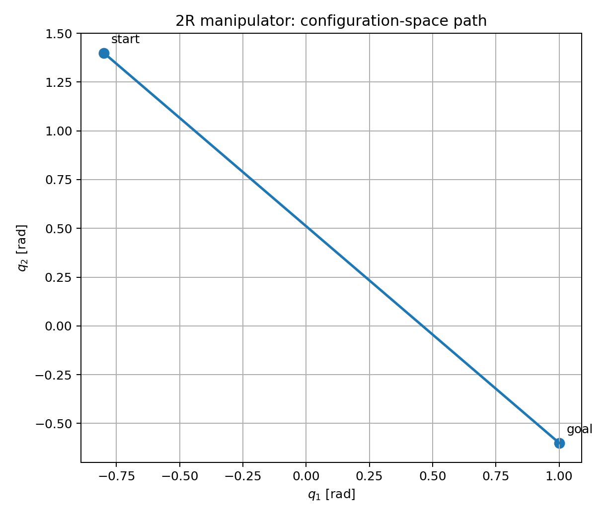

**Figure 1.** A regular discretization of the ordinary 2R configuration space.

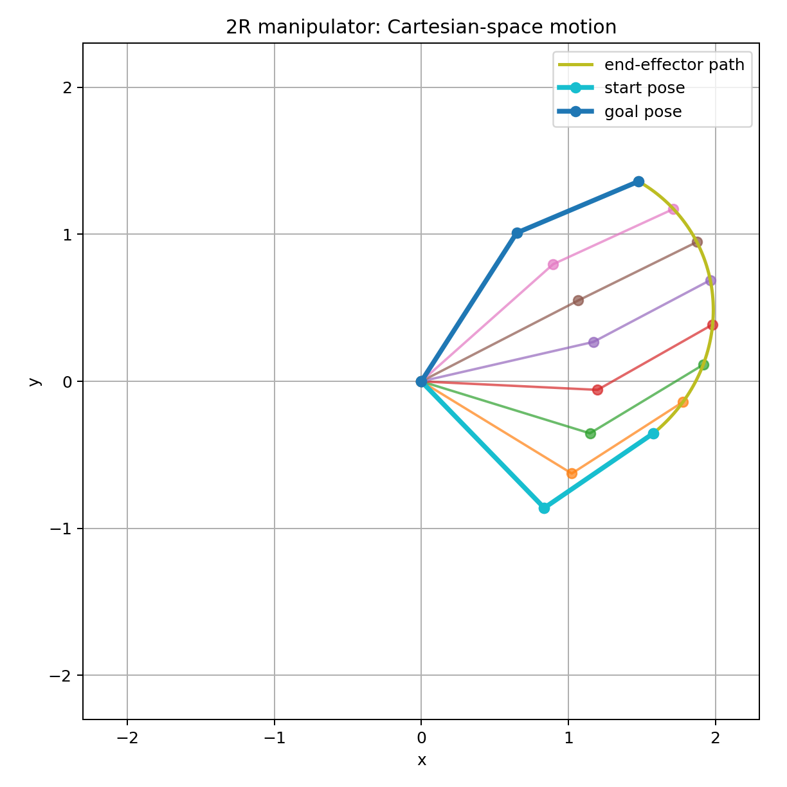

**Figure 2.** Cartesian configurations generated by the regular output-space samples.

### 3.1 Differential kinematics

Differentiating $\mathbf x=f(\mathbf q)$ gives

$$
\dot{\mathbf x}=J_f(\mathbf q)\dot{\mathbf q},
$$

where

$$
J_f(\mathbf q)
=
\begin{bmatrix}
-L_1\sin q_1-L_2\sin(q_1+q_2) & -L_2\sin(q_1+q_2) \\
L_1\cos q_1+L_2\cos(q_1+q_2) & L_2\cos(q_1+q_2)
\end{bmatrix}.
$$

This familiar Jacobian maps joint velocity to Cartesian velocity. In the direct-drive model, the controller commands $\dot{\mathbf q}$ itself. No additional kinematic layer lies between the command and the joint.

### 3.2 Graph representation

Discretize each joint coordinate:

$$
q_1 \in \{q_1^0,\ldots,q_1^{N_1-1}\},
\qquad
q_2 \in \{q_2^0,\ldots,q_2^{N_2-1}\}.
$$

Each grid sample becomes a graph node:

$$
v_{ij}\leftrightarrow(q_1^i,q_2^j).
$$

A four-connected graph allows one joint index to change at a time:

$$
(i,j)\leftrightarrow(i\pm1,j),
$$

$$
(i,j)\leftrightarrow(i,j\pm1).
$$

When edge costs are uniform, many Manhattan paths between the same endpoints have equal cost. The search problem contains a large amount of symmetry and tie degeneracy.

This ordinary graph becomes the baseline against which mechanism-induced inequality is measured.

---

## 4. Distinguishing input, output, and Cartesian spaces

Insert a mechanism between actuator command and manipulator output:

$$
\mathcal U\xrightarrow{g}\mathcal Q\xrightarrow{f}\mathcal X.
$$

Here,

$$
\mathbf u =
\begin{bmatrix}
u_1\\
u_2
\end{bmatrix}
$$

is the input or actuator configuration, while

$$
\mathbf q=g(\mathbf u)
$$

is the output joint configuration.

The Cartesian state is therefore

$$
\mathbf x=f(g(\mathbf u)).
$$

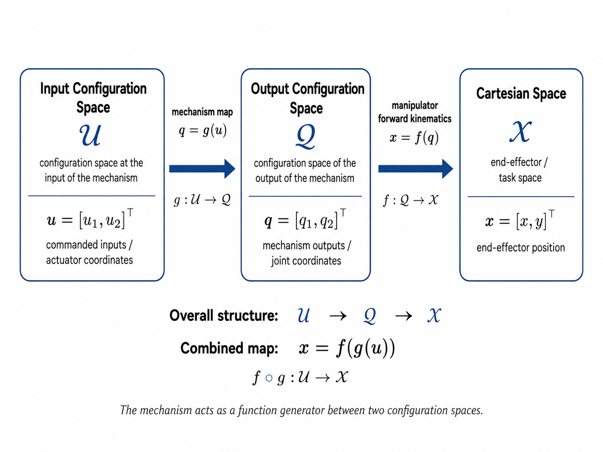

**Figure 3.** The mechanism map and manipulator kinematics are distinct transformations.

### 4.1 Composite differential kinematics

Differentiate:

$$
\dot{\mathbf x}
=
J_f(\mathbf q)\dot{\mathbf q}.
$$

Since

$$
\dot{\mathbf q}
=
J_g(\mathbf u)\dot{\mathbf u},
$$

the composite map is

$$
\dot{\mathbf x}
=
J_f(\mathbf q)J_g(\mathbf u)\dot{\mathbf u}.
$$

The mechanism Jacobian is

$$
J_g(\mathbf u)
=
\frac{\partial \mathbf q}{\partial \mathbf u}.
$$

For independent one-degree-of-freedom transmissions at each joint,

$$
J_g(\mathbf u)
=
\begin{bmatrix}
\dfrac{dq_1}{du_1} & 0\\
0 & \dfrac{dq_2}{du_2}
\end{bmatrix}.
$$

This matrix carries the central inequalities of the project.

### 4.2 Two complementary views of the mechanism map

The distinction between input space and output space supports two complementary representations. They should not be treated as competing definitions of the robot. They expose different parts of the same mechanism relationship.

A conventional manipulator model usually begins directly in output joint coordinates. The planner is given a configuration

$$
\mathbf q\in\mathcal Q
$$

and the transmission that produced that configuration is left implicit. In the ordinary direct-joint model,

$$
\mathbf q=\mathbf u,
$$

so the hidden transmission is the identity map: a unit gearbox at every revolute joint. Because the input and output coordinates coincide, the mechanism layer disappears from view. A uniform grid in $\mathcal Q$ then appears to be a neutral description of the arm, even though it has already assumed a particular transmission.

The reader can be brought into the more general formulation in two stages.

#### Mechanism view: uniform input mapped into output

First sample the actuator-side coordinates uniformly:

$$
\mathbf u_{\mathbf i}
=
\mathbf u_{\min}+\mathbf i\odot\Delta\mathbf u,
$$

and map those samples through the mechanism:

$$
\mathbf q_{\mathbf i}=g_m(\mathbf u_{\mathbf i}).
$$

The graph remains regular in $\mathcal U$, but its image in $\mathcal Q$ is generally nonuniform. Locally,

$$
d\mathbf q=J_{g_m}(\mathbf u)d\mathbf u.
$$

Equal actuator increments therefore become unequal output increments whenever $J_{g_m}$ varies with configuration. This is the **mechanism view**:

> A uniform input graph reveals what motion the function generator physically generates.

For the unit gearbox, the mapped graph remains uniform. For a fixed gearbox, it is uniformly scaled. For a four-bar, it stretches, compresses, and may fold. This view makes the function-generator effect visible before planning costs or search algorithms are introduced.

#### Planning-control view: uniform output with mechanism-dependent weights

The complementary experiment begins with a common output grid:

$$
\mathbf q_{\mathbf j}
=
\mathbf q_{\min}+\mathbf j\odot\Delta\mathbf q.
$$

Different mechanisms then share the same nominal arm configurations, adjacency, joint limits, start state, goal state, and output resolution. The mechanism enters through the input states and costs required to traverse each output-space edge.

On a locally invertible branch,

$$
\mathbf u=g_m^{-1}(\mathbf q),
$$

so an output edge $\mathbf q_a\leftrightarrow\mathbf q_b$ can be assigned a mechanism-dependent actuator-travel cost

$$
c_m(a,b)
=
\left\|
 g_m^{-1}(\mathbf q_b)-g_m^{-1}(\mathbf q_a)
\right\|_{W_u}.
$$

The two mechanisms can therefore have the same nodes and edges but different edge weights:

$$
G_m=(V_Q,E_Q,c_m).
$$

A planner may then select different output-space and Cartesian paths because the transmissions assign different actuator-side significance to the same possible arm motions. This is the **planning-control view**:

> A uniform output graph reveals how different transmissions value the same possible arm motions.

The uniform output representation initially obscures the function generator because the node geometry is identical across mechanisms. The mechanism becomes visible again only when inverse kinematics, branch state, feasibility, or mechanism-dependent cost is attached to the graph. Without those additions, a uniform $\mathcal Q$ graph silently models every joint as though it were driven through the unit gearbox.

These views should remain paired throughout the paper:

$$
\boxed{
\text{uniform }\mathcal U
\xrightarrow{g_m}
\text{deformed }\mathcal Q
}
\qquad
\text{mechanism view},
$$

$$
\boxed{
\text{uniform }\mathcal Q
\xrightarrow{g_m^{-1}}
\text{nonuniform }\mathcal U
\text{ with mechanism-dependent cost}
}
\qquad
\text{planning-control view}.
$$

The first explains the generated inequality. The second provides a controlled comparison of its planning consequences.

A mapped uniform-$\mathcal U$ graph and a separately sampled uniform-$\mathcal Q$ graph are not generally the same discrete graph. They are different samplings of the same continuous mechanism relationship. Only an affine map such as a fixed-ratio gearbox preserves uniform spacing in both coordinates.

For a non-injective mechanism, $g_m^{-1}(\mathbf q)$ is set-valued. The planning-control state must then be lifted to include the preimage or branch label,

$$
(\mathbf q,\sigma),
$$

so physically distinct mechanism states are not collapsed merely because they share an output coordinate. The simple uniform-$\mathcal Q$ comparison is therefore cleanest on a monotonic branch; the full-cycle case requires a lifted output graph.

---

## 5. Gearboxes: constant inequality

For a gearbox,

$$
q=ru.
$$

The transmission derivative is constant:

$$
\frac{dq}{du}=r.
$$

A unit gearbox has $r=1$ and preserves equality. A non-unit gearbox stretches or compresses the coordinate.

### 5.1 Speed

Differentiating gives

$$
\dot q=r\dot u.
$$

When $|r|>1$, a given actuator speed produces greater output speed. When $|r|<1$, the output moves more slowly.

### 5.2 Resolution

For a finite encoder increment $\Delta u$,

$$
\Delta q=r\Delta u.
$$

Thus a smaller $|r|$ gives finer output resolution.

### 5.3 Torque

Assume an ideal lossless transmission. Instantaneous power balance gives

$$
\tau_u\dot u=\tau_q\dot q.
$$

Substitute $\dot q=r\dot u$:

$$
\tau_u\dot u=\tau_q r\dot u.
$$

For nonzero $\dot u$,

$$
\tau_q=\frac{\tau_u}{r}.
$$

A slower output ratio therefore increases ideal output torque while reducing output speed and improving output resolution.

### 5.4 Graph geometry

For two independent gearboxes,

$$
\mathbf q=
\begin{bmatrix}
r_1u_1\\
r_2u_2
\end{bmatrix}.
$$

A differential input displacement is mapped as

$$
d\mathbf q=
\begin{bmatrix}
r_1&0\\
0&r_2
\end{bmatrix}
d\mathbf u.
$$

The resulting output-space differential length is

$$
ds_{\mathcal Q}^2
=
r_1^2du_1^2+r_2^2du_2^2.
$$

The input grid is anisotropically scaled but remains globally regular.

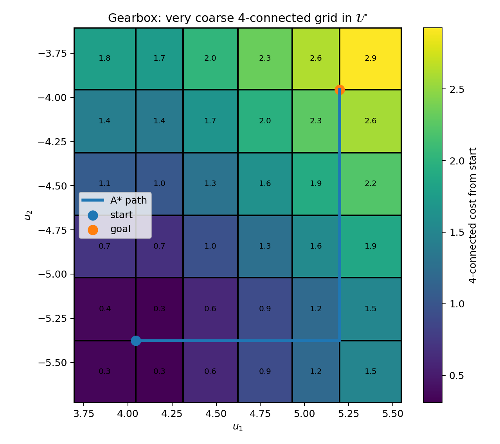

**Figure 4.** A coarse four-connected gearbox graph in input space.

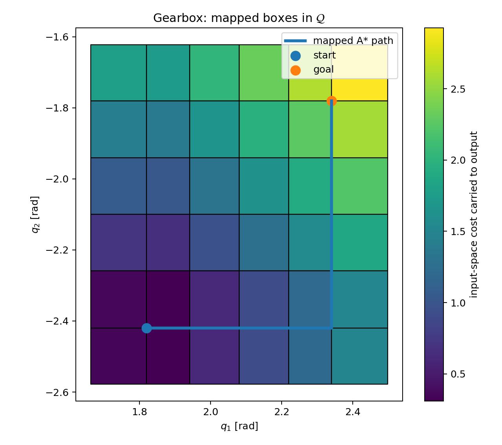

**Figure 5.** The same graph mapped into output space.

The gearbox is the introductory inequality mechanism because it makes the deformation visible without introducing nonlinear geometry.

---

## 6. Four-bar mechanisms: variable inequality

Consider a planar four-bar with input crank length $a$, coupler length $b$, follower length $c$, and ground length $d$. Let

$$
u=\theta_2
$$

be the input crank angle and

$$
q=\theta_4
$$

be the follower angle.

The vector-loop equation is

$$
a e^{i\theta_2}+b e^{i\theta_3}
=
d+c e^{i\theta_4}.
$$

Separating real and imaginary components:

$$
a\cos\theta_2+b\cos\theta_3
=
d+c\cos\theta_4,
$$

$$
a\sin\theta_2+b\sin\theta_3
=
c\sin\theta_4.
$$

Eliminating the coupler angle produces an implicit input-output relation

$$
F(\theta_2,\theta_4)=0.
$$

A standard Freudenstein form can be written as [1,2]

$$
K_1\cos\theta_4
-
K_2\cos\theta_2
+
K_3
=
\cos(\theta_2-\theta_4),
$$

where one common parameterization is

$$
K_1=\frac{d}{a},
\qquad
K_2=\frac{d}{c},
\qquad
K_3=
\frac{a^2-b^2+c^2+d^2}{2ac}.
$$

Sign conventions vary with the loop definition, but the important point is unchanged: the follower is a nonlinear function of the input.

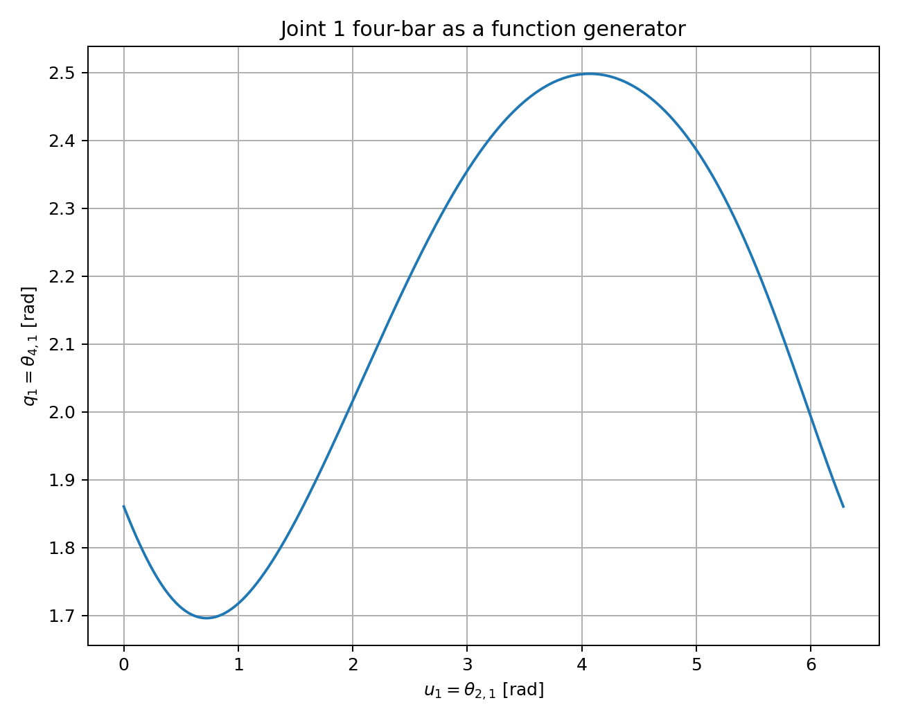

**Figure 6.** Four-bar function generation at joint 1.

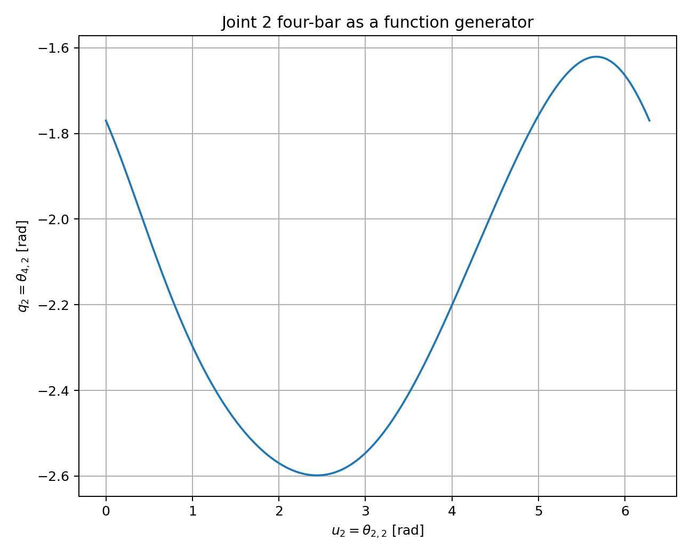

**Figure 7.** Four-bar function generation at joint 2.

### 6.1 Deriving the local transmission ratio

Differentiate the implicit relation

$$
F(u,q)=0.
$$

The total differential is

$$
F_u\,du+F_q\,dq=0.
$$

Therefore,

$$
\frac{dq}{du}
=
-\frac{F_u}{F_q}.
$$

Using the Freudenstein-style equation above,

$$
F(u,q)
=
K_1\cos q
-
K_2\cos u
+
K_3
-
\cos(u-q).
$$

Its partial derivatives are

$$
F_u
=
K_2\sin u+\sin(u-q),
$$

$$
F_q
=
-K_1\sin q-\sin(u-q).
$$

Hence,

$$
\frac{dq}{du}
=
\frac{K_2\sin u+\sin(u-q)}
{K_1\sin q+\sin(u-q)}.
$$

The exact expression depends on the selected convention, but its defining property is configuration dependence.

### 6.2 Speed, resolution, and torque

The same relationships derived for a gearbox now vary with $u$.

#### Speed

$$
\dot q
=
\frac{dq}{du}\dot u.
$$

#### Resolution

$$
\Delta q
\approx
\frac{dq}{du}\Delta u.
$$

#### Ideal torque

From power balance,

$$
\tau_u\dot u
=
\tau_q\dot q,
$$

and therefore

$$
\tau_q
=
\frac{\tau_u}{dq/du}.
$$

Where $\left|dq/du\right|$ is large:

- output speed is high,
- output resolution is coarse,
- output torque is low.

Where $\left|dq/du\right|$ is small:

- output speed is low,
- output resolution is fine,
- output torque is high.

These are not independent design properties. They are different views of the same local mechanism geometry.

### 6.3 Practical limitations near zero transmission ratio

Near a follower reversal,

$$
\frac{dq}{du}\rightarrow0.
$$

The ideal expression suggests unbounded torque amplification and arbitrarily fine output resolution. A real system is limited by:

- friction,
- compliance,
- backlash,
- finite structural stiffness,
- load-dependent deformation,
- actuator current limits,
- control sensitivity,
- and loss of useful motion authority.

The singular ideal remains important because it marks the geometric tendency, but a design must remain a finite distance from unusable or dangerous conditions.

---

## 7. The induced metric

Suppose a planner constructs a graph in input space but measures motion cost in output space.

For an infinitesimal input displacement,

$$
d\mathbf q=J_g(\mathbf u)d\mathbf u.
$$

The squared output-space line element is

$$
ds_{\mathcal Q}^2
=
d\mathbf q^\mathsf T W_q d\mathbf q,
$$

where $W_q$ is an optional positive-semidefinite output weighting matrix.

Substitute the mechanism differential:

$$
ds_{\mathcal Q}^2
=
d\mathbf u^\mathsf T
J_g(\mathbf u)^\mathsf T
W_q
J_g(\mathbf u)
d\mathbf u.
$$

Define the induced input-space metric

$$
M(\mathbf u)
=
J_g(\mathbf u)^\mathsf T
W_q
J_g(\mathbf u).
$$

For a unit gearbox,

$$
M=I.
$$

For a fixed gearbox,

$$
M=
\begin{bmatrix}
r_1^2&0\\
0&r_2^2
\end{bmatrix}.
$$

For independent four-bars,

$$
M(\mathbf u)
=
\begin{bmatrix}
w_1\left(\dfrac{dq_1}{du_1}\right)^2&0\\
0&w_2\left(\dfrac{dq_2}{du_2}\right)^2
\end{bmatrix}.
$$

The four-bar therefore turns a uniform actuator lattice into a spatially varying metric field.

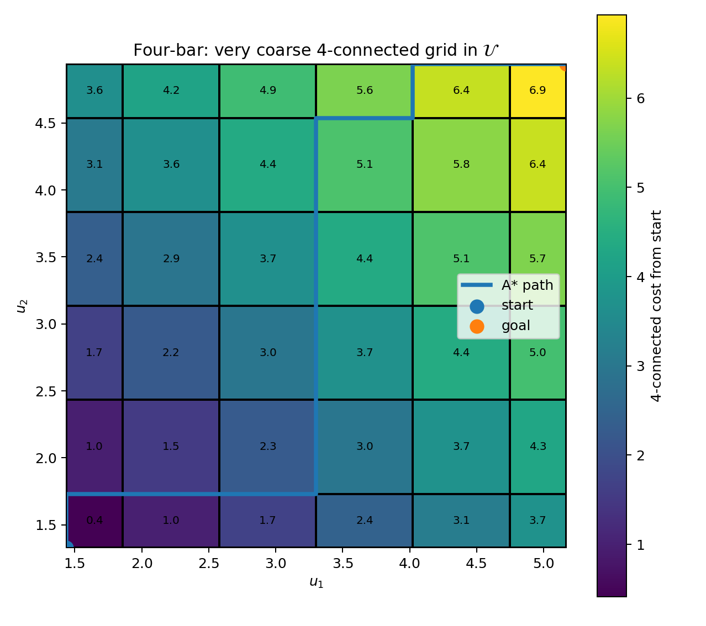

**Figure 8.** The four-bar graph remains regular in actuator coordinates.

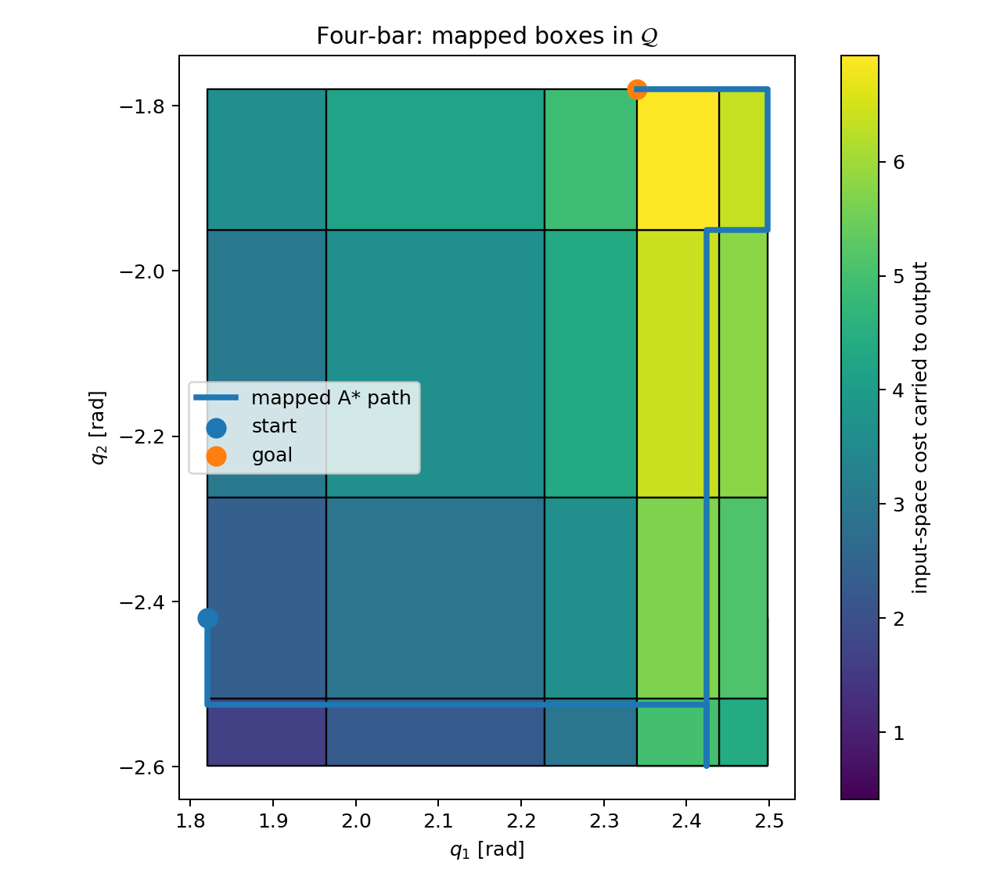

**Figure 9.** The mapped graph contains configuration-dependent inequality.

This is the most direct mathematical interpretation of an inequality mechanism:

> It transforms equal actuator increments into unequal physical distances and capabilities.

### 7.1 The same physical cost in either coordinate view

Sampling and cost are separate choices. A graph may be sampled uniformly in one coordinate space while its edge cost is defined by motion in another.

If actuator-side displacement is the physical cost,

$$
ds_U^2
=
d\mathbf u^\mathsf T W_u d\mathbf u,
$$

then, on an invertible branch,

$$
d\mathbf u
=
J_g(\mathbf u)^{-1}d\mathbf q.
$$

The same cost expressed on a uniform output graph is

$$
ds_U^2
=
d\mathbf q^\mathsf T
J_g(\mathbf u)^{-\mathsf T}
W_u
J_g(\mathbf u)^{-1}
d\mathbf q.
$$

Define the mechanism-dependent output-coordinate metric

$$
M_Q(\mathbf q)
=
J_g^{-\mathsf T}W_uJ_g^{-1},
$$

with $\mathbf u=g^{-1}(\mathbf q)$ on the selected branch. Thus the two descriptions are dual:

$$
M_U(\mathbf u)
=
J_g^\mathsf T W_q J_g
$$

pulls output cost back onto an input graph, while

$$
M_Q(\mathbf q)
=
J_g^{-\mathsf T}W_uJ_g^{-1}
$$

expresses actuator cost on an output-coordinate graph.

A controlled planning comparison can retain both distances through a normalized additive objective:

$$
c_\alpha(e)
=
\alpha\frac{d_Q(e)}{s_Q}
+
(1-\alpha)\frac{d_U(e)}{s_U},
\qquad
0\le\alpha\le1,
$$

where $s_Q$ and $s_U$ are declared characteristic scales. The endpoint $\alpha=1$ removes the mechanism from the cost and becomes a pure-output null control. The endpoint $\alpha=0$ measures actuator travel alone. Intermediate values ask when a transmission-dependent valuation becomes strong enough to alter the selected arm path.

The underlying path objective can therefore be written independently of the selected graph coordinates. For a physical mechanism path

$$
\gamma(t)
=
\bigl(\mathbf u(t),\mathbf q(t)\bigr),
\qquad
\mathbf q(t)=g(\mathbf u(t)),
$$

define

$$
C[\gamma]
=
\int_0^T
L\left(
\mathbf u,
\mathbf q,
\dot{\mathbf u},
\dot{\mathbf q}
\right)dt.
$$

A uniform-$\mathcal U$ graph and a uniform-$\mathcal Q$ graph can then approximate the same continuous cost functional even though they have different nodes, edge lengths, and discretization errors. In the fine-grid limit, their optimal physical costs should converge when they preserve the same mechanism branch, feasibility rules, and objective. Their node-expansion counts need not converge to the same value because search effort depends on the chosen discretization.

---

## 8. Joint limits and hidden mechanism state

A fair comparison should apply the same output joint limits to both mechanisms:

$$
q_{i,\min}\le q_i\le q_{i,\max}.
$$

### 8.1 Unit gearbox

For $q=u$,

$$
u_{i,\min}=q_{i,\min},
\qquad
u_{i,\max}=q_{i,\max}.
$$

The valid input interval is contiguous.

### 8.2 Four-bar preimage

For $q=\psi(u)$, the valid set is

$$
\mathcal U_{\mathrm{valid}}
=
\left\{
u:
q_{\min}\le\psi(u)\le q_{\max}
\right\}.
$$

A crank-rocker follower commonly traverses much of its output range twice during one crank cycle. Thus,

$$
u_a\neq u_b,
\qquad
\psi(u_a)=\psi(u_b).
$$

The same output angle can correspond to distinct internal mechanism states.

For two four-bars,

$$
\mathcal U=S^1\times S^1,
$$

so the unfiltered input domain is toroidal. Output joint limits carve valid regions from this torus, potentially creating multiple sheets or disconnected components.

### 8.3 Why non-injective search belongs in input or lifted state

If two input states share the same output coordinate, an output-only graph may collapse them into one node. That can create false connectivity: the planner may enter the merged node through an edge belonging to one physical state and leave through an edge belonging to the other.

The physically complete graph node is instead

$$
v=
\left(
u_1,u_2,q_1,q_2,\text{assembly state}
\right),
$$

or an equivalent lifted output state such as $(\mathbf q,\sigma)$ that preserves the missing preimage label. Full-cycle and non-injective planning should therefore retain input or lifted-state identity.

On a certified monotonic branch, however, $g^{-1}(q)$ is unique and the output coordinate is a complete kinematic state. A uniform-$\mathcal Q$ graph is then valid, provided that every node and transition retains its mechanism-specific actuator realization.

---

## 9. Graph-search formulation

Let the discrete input graph be

$$
G_m=(V_m,E_m)
$$

for mechanism design $m$.

Each node carries an input configuration $\mathbf u_v$ and output configuration

$$
\mathbf q_v=g_m(\mathbf u_v).
$$

### 9.1 Node validity

A node is valid if:

1. the mechanism assembles,
2. the selected assembly state remains consistent,
3. the output joint limits are satisfied,
4. any collision or task constraints are satisfied.

### 9.2 Edge validity

For neighboring nodes $a$ and $b$, interpolate the input:

$$
\mathbf u(s)
=
(1-s)\mathbf u_a+s\mathbf u_b,
\qquad
0\le s\le1.
$$

The entire edge must remain valid. Endpoint-only checking may miss an intermediate joint-limit or assembly violation.

### 9.3 Candidate edge costs

#### Input distance

$$
c_U(a,b)
=
\|\mathbf u_b-\mathbf u_a\|_2.
$$

#### Output distance

$$
c_Q(a,b)
=
\|g_m(\mathbf u_b)-g_m(\mathbf u_a)\|_2.
$$

#### Cartesian distance

$$
c_X(a,b)
=
\|f(g_m(\mathbf u_b))-f(g_m(\mathbf u_a))\|_2.
$$

#### Hybrid capability cost

$$
c(a,b)
=
w_Uc_U
+
w_Qc_Q
+
w_Xc_X
+
w_Ec_E
+
w_Tc_T.
$$

The graph remains an input-side graph, but its meaning depends on the selected cost.

### 9.4 Dijkstra and A*

Dijkstra orders nodes by accumulated path cost:

$$
F(n)=g(n).
$$

A* adds a cost-to-go estimate:

$$
F(n)=g(n)+h(n).
$$

For output-distance edge costs, a natural heuristic is

$$
h_Q(n)
=
\|\mathbf q_n-\mathbf q_g\|_2.
$$

Because a straight-line distance is no greater than the length of any path joining the same endpoints, this heuristic is a lower bound on accumulated Euclidean output path length.

### 9.5 Meaning of “faster search”

The primary metric is node expansions:

$$
N_{\mathrm{expanded}}.
$$

A node is counted when it is removed from the priority queue with its valid best-known cost and its outgoing edges are examined.

Additional metrics include

$$
N_{\mathrm{generated}},
\qquad
N_{\mathrm{path}},
\qquad
C^*,
$$

and normalized expansion fraction

$$
\rho_{\mathrm{expanded}}
=
\frac{N_{\mathrm{expanded}}}
{N_{\mathrm{valid\ nodes}}}.
$$

---

## 10. Matched Cartesian endpoints

A mechanism comparison should use matched output configurations and therefore matched Cartesian start and goal poses.

For a unit gearbox,

$$
\mathbf u_s=\mathbf q_s,
\qquad
\mathbf u_g=\mathbf q_g.
$$

For a four-bar, choose valid preimages satisfying

$$
g_m(\mathbf u_s)=\mathbf q_s,
$$

$$
g_m(\mathbf u_g)=\mathbf q_g.
$$

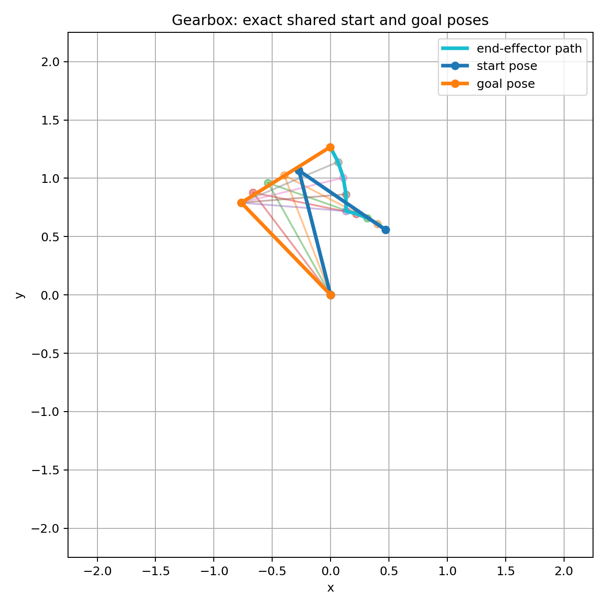

**Figure 10.** Gearbox Cartesian path.

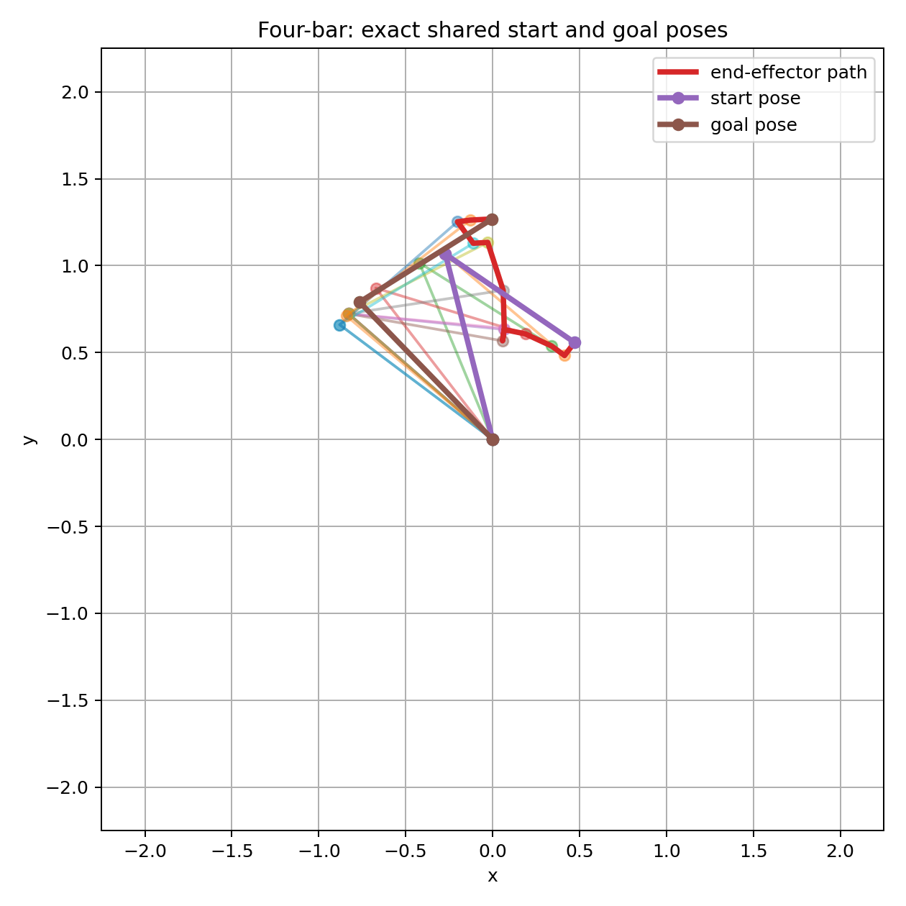

**Figure 11.** Four-bar Cartesian path.

Even when the start and goal poses match, the internal graph path and reconstructed Cartesian path can differ.

---

## 11. Early Monte Carlo pilot

A preliminary pilot sampled random crank-rocker pairs and matched each planning trial against a unit-ratio gearbox.

The implementation used:

- two independently sampled crank-rocker four-bars,
- shared follower joint limits,
- full periodic crank coordinates,
- four-connected input graphs,
- output-space edge costs,
- Dijkstra and A*,
- paired output start and goal configurations.

The pilot included 560 matched start-goal trials.

### 11.1 Preliminary observation

The four-bar graphs expanded substantially fewer nodes in this pilot.

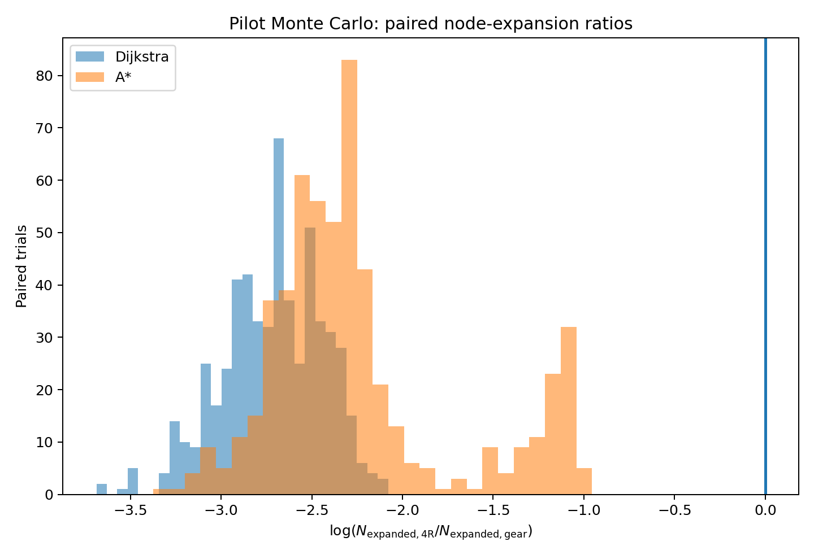

**Figure 12.** Paired node-expansion ratios. Values below zero favor the four-bar.

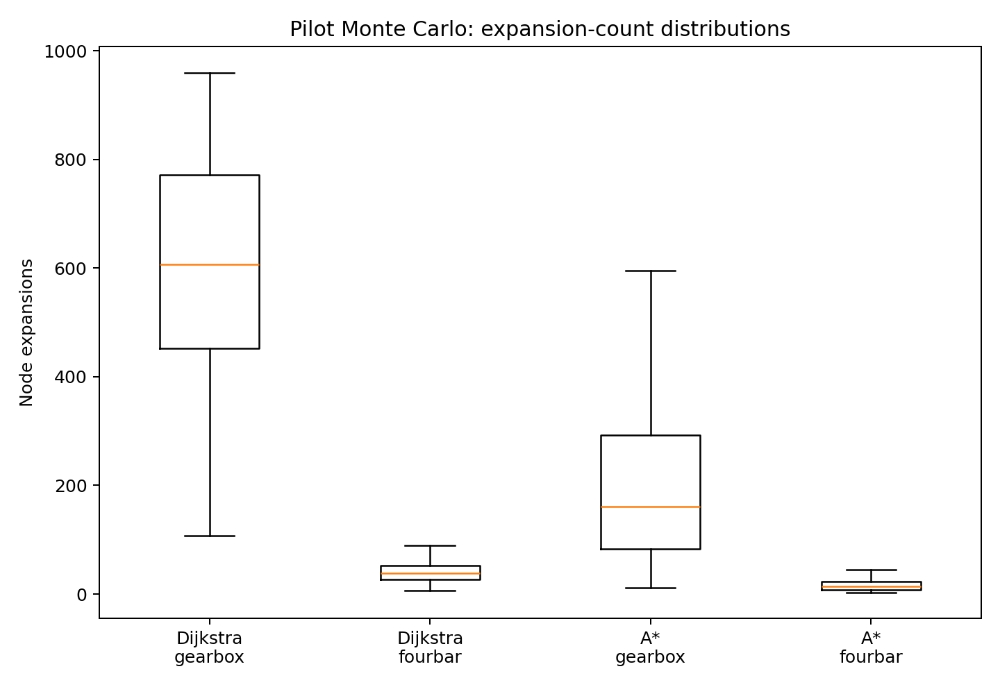

**Figure 13.** Raw expansion distributions in the pilot study.

### 11.2 Why this is not yet a conclusion

The pilot mixed several effects:

- four-bar graphs often had fewer valid nodes,
- joint-limit preimages changed topology,
- periodic input boundaries introduced alternate routes,
- duplicate follower preimages shortened some input-side paths,
- nonuniform weights broke equal-cost degeneracy,
- matched output endpoints did not imply matched discrete input distance.

The result is best treated as an early finding:

> Adding a nonlinear mechanism can dramatically change the computational structure of path planning.

The controlled study must determine which mechanism properties are responsible and whether the effect persists under equal graph size and comparable output resolution.

---

## 12. Proposed controlled study

### 12.1 Mechanism population

Sample many crank-rocker mechanisms with normalized ground length

$$
d=1.
$$

Filter for:

- strict Grashof behavior,
- a full input-crank cycle,
- continuous selected assembly mode,
- minimum follower range,
- minimum distance from change-point degeneracy,
- practical transmission-ratio bounds.

Two independently sampled mechanisms drive the two manipulator joints.

### 12.2 Paired task generation

For each mechanism pair:

1. define shared output joint limits,
2. sample valid output start and goal configurations,
3. choose specified input preimages,
4. build the four-bar graph,
5. build the matched unit-gearbox graph,
6. run identical algorithms,
7. compare paired expansion counts and path metrics.

### 12.3 Experimental modes

#### Native implementation

Use fixed actuator resolution for each mechanism.

This measures actual implementation consequences, including graph-size changes.

#### Equal valid-node count

Adjust grid resolution to produce comparable graph sizes.

This reduces the graph-size confound.

#### Equal approximate output resolution

Choose local or adaptive input resolution so that adjacent samples produce comparable output increments.

This better isolates metric and topology.

#### Monotonic-branch ablation

Restrict each follower to a locally invertible branch.

This removes duplicate preimages.

#### Full-cycle ablation

Restore the complete periodic crank cycle.

This measures hidden-state and toroidal-topology effects.

### 12.4 Mechanism descriptors

For each mechanism, calculate:

$$
\mu_J
=
\mathbb E\left[\left|\frac{dq}{du}\right|\right],
$$

$$
\sigma_J
=
\operatorname{std}\left(\left|\frac{dq}{du}\right|\right),
$$

near-stationary fraction

$$
P_\epsilon
=
\Pr\left(\left|\frac{dq}{du}\right|<\epsilon\right),
$$

and metric condition number

$$
\kappa(M)
=
\frac{\lambda_{\max}(M)}
{\lambda_{\min}(M)}.
$$

Then determine which descriptors predict node expansions, normalized expansions, path length, and loopiness.

---

## 13. Quantifying the loop phenomenon

A Cartesian path may cross itself, nearly revisit itself, or contain a hook that is visually recognizable but difficult to describe with one scalar.

Let the sampled end-effector path be

$$
\mathbf x_0,\mathbf x_1,\ldots,\mathbf x_N.
$$

### 13.1 Self-intersection count

Count intersections between nonadjacent segments:

$$
N_{\mathrm{cross}}
=
\#\left\{
(i,j):
[\mathbf x_i,\mathbf x_{i+1}]
\cap
[\mathbf x_j,\mathbf x_{j+1}]
\neq\varnothing
\right\}.
$$

### 13.2 Detour ratio

$$
R_{\mathrm{detour}}
=
\frac{
\sum_{k=0}^{N-1}
\|\mathbf x_{k+1}-\mathbf x_k\|
}{
\|\mathbf x_N-\mathbf x_0\|
}.
$$

A value near one indicates little excess travel. Larger values indicate indirect motion, though not necessarily a literal loop.

### 13.3 Cumulative turning

Define path-segment heading

$$
\phi_k
=
\operatorname{atan2}
\left(
y_{k+1}-y_k,
x_{k+1}-x_k
\right).
$$

Then

$$
T
=
\sum_{k=0}^{N-2}
\left|
\operatorname{wrap}
(\phi_{k+1}-\phi_k)
\right|.
$$

### 13.4 Near-revisit distance

Exclude a neighborhood of adjacent samples and calculate

$$
d_{\mathrm{revisit}}
=
\min_{|i-j|>m}
\|\mathbf x_i-\mathbf x_j\|.
$$

The initial analysis should retain these metrics separately. A composite loop score should be introduced only after their behavior is understood.

A testable hypothesis is:

> Mechanism-induced inequality may reduce visually awkward loop-like trajectories by breaking equal-cost path degeneracy.

A competing possibility is equally important:

> A mechanism may reduce search effort while increasing Cartesian path complexity.

---

## 14. Intrinsic capability fields

The mechanism-induced metric is only one quantity that can be embedded in planning.

At each configuration, define capability fields such as:

$$
v_{\max}(\mathbf u),
\qquad
\tau_{\max}(\mathbf u),
\qquad
r_{\mathrm{enc}}(\mathbf u),
\qquad
E(\mathbf u,\dot{\mathbf u}),
\qquad
A_{\max}(\mathbf u).
$$

### 14.1 High-speed motion

A point-to-point task may prefer regions where

$$
\left|\frac{dq}{du}\right|
$$

is large.

### 14.2 Precision arrival

A manipulation task may prefer a terminal state where

$$
\left|\frac{dq}{du}\right|
$$

is small, providing fine output resolution.

### 14.3 Torque and restart capability

The same low-speed region offers high ideal torque amplification. A terminal cost can reward ending in a state that is useful for the next action.

The gravity-free planar 2R force set is the exact actuator torque-box image

$$
\mathcal W(u)=\{w=[F_x,F_y]^\mathsf T:\lvert J_{xu}(u)^\mathsf T w\rvert\le\bar\tau_u\},
$$

with normalized $\bar\tau_u=[1,1]^\mathsf T$. Regular states are parallelograms obtained by mapping torque-box corners; rank-deficient states keep the H-representation and a typed unbounded ideal direction rather than a clipped fake polygon. The primary scalar field is the inscribed isotropic radius $r_{\mathrm{iso}}$. This is kinematic geometry plus virtual work, not a gravity, payload, or structural-strength model, and it is not a claim about biological joint strength. See [ADR-028](../../software/architecture/adr/ADR-028-gravity-free-static-wrench.md) and the [method note](../../software/architecture/notes/STATIC_WRENCH_KINEMATIC_GEOMETRY_METHOD.md).

### 14.4 Ballistic tasks

For a throw, kick, or strike, trajectory optimization may guide the mechanism into a high-speed region near release.

### 14.5 Energy-aware planning

A more complete edge cost may include actuator work:

$$
c_E(a,b)
\approx
\int_{t_a}^{t_b}
\boldsymbol{\tau}_u^\mathsf T\dot{\mathbf u}\,dt,
$$

or electrical and loss models when available.

### 14.6 Multiobjective objective

A trajectory and mechanism design can be judged by

$$
J
=
w_tT
+
w_EE
+
w_pN_{\mathrm{expanded}}
+
w_xL_{\mathcal X}
+
w_r\Phi_{\mathrm{resolution}}
+
w_\tau\Phi_{\mathrm{torque}}.
$$

The mechanism defines a capability landscape. Planning determines how the robot moves through it.

---

## 15. Mechanism as anatomy: surgical and prosthetic joints

This section provides the narrative bridge from classical mechanism design to embodied intelligence. The present claims should be read beside the knee-kinematics and prosthetic-linkage literature rather than as a settled description of every biological or surgical joint [12–15].

A biological hip is comparatively close to a ball-and-socket abstraction. A knee is not well represented as a fixed ideal hinge. Its articular geometry, soft tissues, rolling-sliding contact, and changing instantaneous axis generate a configuration-dependent relationship between the femur and tibia.

Four-bar and polycentric models have been used in [12–15]:

- biomechanical descriptions of knee motion,
- external prosthetic knees,
- rehabilitation and exoskeleton mechanisms,
- and some efforts to reproduce or accommodate natural joint kinematics in implant design.

These categories must remain distinct. A total joint replacement, an external prosthetic knee, and a rehabilitation linkage solve different problems.

The important conceptual observation is simpler:

> Anatomy embodies a motion relationship.

A surgical or prosthetic mechanism is not merely replacing a missing revolute joint. It may be attempting to reconstruct stability, leverage, clearance, or a changing center of rotation.

This example demonstrates that mechanism synthesis can be understood as the deliberate encoding of joint behavior.

**Literature task before publication:** conduct a focused review of four-bar and polycentric models in knee biomechanics, prosthetics, arthroplasty, and elbow replacement. Verify which implant designs literally incorporate linkage mechanisms and which merely approximate biological kinematics through shaped contact surfaces.

---

## 16. Mechanism-controller co-design

Let $m$ denote mechanism geometry and let $\pi$ denote a controller or planning policy.

The mechanism defines

$$
g_m:\mathcal U\rightarrow\mathcal Q.
$$

A task-distribution objective can be written as

$$
\min_{m,\pi}
\;
\mathbb E_{\mathcal T}
\left[
J_{\mathrm{task}}(m,\pi;\mathcal T)
\right].
$$

A decomposed form might include

$$
J_{\mathrm{task}}
=
w_pJ_{\mathrm{planning}}
+
w_EJ_{\mathrm{energy}}
+
w_vJ_{\mathrm{speed}}
+
w_\tau J_{\mathrm{torque}}
+
w_rJ_{\mathrm{resolution}}
+
w_cJ_{\mathrm{control}}.
$$

Classical mechanism synthesis selects the map. Graph search or trajectory optimization selects a path. Control stabilizes its execution. Existing robot co-design work already optimizes morphology, motion, actuator parameters, or learned policies together; the proposed distinction here is the explicit treatment of a classical function-generating mechanism as a graph-shaping map [9–11].

The intended contribution is not to replace these classical methods. It is to expose a shared design space between them.

---

## 17. Reinforcement learning extension

Reinforcement learning enters after deterministic planning has established measurable graph effects. This stage should be positioned relative to existing morphology–control and hardware–policy co-design research rather than presented as the first attempt to optimize bodies with learning [9–11].

### 17.1 Initial learning experiment

Use the same task distribution and learning architecture across:

- a unit gearbox,
- selected four-bars,
- four-bars optimized for search metrics.

Measure:

$$
N_{\mathrm{episodes\ to\ criterion}},
$$

$$
N_{\mathrm{environment\ interactions}},
$$

success rate, final return, path cost, and generalization to unseen goals.

### 17.2 Central learning question

> Do mechanisms that reduce graph-search node expansions also reduce reinforcement-learning sample complexity?

A positive result would support the chain

$$
\text{mechanism geometry}
\rightarrow
\text{state-transition geometry}
\rightarrow
\text{reduced learning burden}.
$$

It would not prove a universal rule. A highly skewed mechanism could also create:

- stiff local dynamics,
- narrow high-performing regions,
- poor exploration,
- sensitivity near singular configurations,
- and difficult reward landscapes.

### 17.3 Co-design experiment

Allow mechanism parameters and policy parameters to change together.

Then ask:

> Does learning rediscover the same graph-shaping properties predicted by classical mechanism analysis?

This comparison could connect mechanism synthesis, planning, and embodied learning in a single software framework.

---

## 18. Embodied intelligence and the biological conjecture

Embodied intelligence treats behavior as emerging from a coupled system [3–8,16]:

$$
\text{controller}
\leftrightarrow
\text{body}
\leftrightarrow
\text{environment}.
$$

Passive dynamic walking is the canonical mechanical example: a suitably shaped legged mechanism can settle into a stable walking cycle with little or no continuous active control, making the body dynamics part of the solution rather than merely the object being controlled [3].

The body is not a neutral plant that merely receives commands. Its geometry, compliance, inertia, and contact relationships participate in behavior.

This paper proposes a specifically kinematic and graph-theoretic interpretation.

For morphology $m$, define a physically realizable transition graph

$$
G_m=(V_m,E_m,c_m).
$$

Morphology affects:

- which states exist,
- which transitions are adjacent,
- what those transitions cost,
- where speed and torque are available,
- where motion is precise,
- and which routes are stable or natural.

Different bodies may not simply execute different policies on one universal graph.

They may inhabit different graphs.

### 18.1 The conjecture

> Biological morphology may reduce the effective search and learning complexity of motor behavior by shaping the topology, metric, and dynamics of physically realizable state transitions.

This is not the claim that bones calculate symbolically.

It is the claim that intelligence does not begin in an empty motion space.

Joint surfaces, ligaments, tendons, muscle moment arms, compliance, mass distribution, neural circuitry, and environmental contact collectively create a structured prior over movement.

A newborn animal inherits more than a controller. It inherits a problem already shaped by evolution.

### 18.2 Creativity and constraint

The closed kinematic chain offers a useful literary analogy that is also mechanically literal.

Without constraint, the links possess more freedom but no particular generated function. Constraint removes possibilities and simultaneously produces character.

> Creativity does not occur despite constraint. Constraint gives the space of possibilities its shape.

An equal revolute-joint chain is general. An inequality mechanism is opinionated. It sacrifices neutrality to embody preference, leverage, rhythm, precision, or speed.

The body becomes less universal and more capable of something.

---


## 19. Literature map and reading program

This section is deliberately more than a bibliography. It records what each source is expected to contribute to the argument, what should be read first, and where the literature may resist the proposed framing.

### 19.1 First reading pass

#### Classical mechanism theory

**[1] Freudenstein — four-bar input/output synthesis.**  
Read first for the historical and analytical foundation of treating a four-bar as a function generator. The paper is important not only for the equation that bears Freudenstein’s name, but because it frames mechanism geometry as a deliberate mapping between input and output motion.

**[2] Hunt — kinematic geometry and mechanism structure.**  
Read alongside Freudenstein for the geometrical language behind lower pairs, higher pairs, closed chains, freedom, and structure. This is a book rather than a paper, but it is central to the intellectual lineage of the project and to the eventual discussion of biological joints and kinematic substitution.

#### Embodied intelligence and morphological computation

**[3] McGeer — passive dynamic walking.**  
The cleanest demonstration that morphology and dynamics can generate organized behavior without a conventional continuously commanding controller.

**[4] Pfeifer and Bongard — embodiment as an enabling constraint.**  
The broad conceptual introduction. Particularly relevant to the language that the body both constrains and enables cognition and behavior.

**[5] Hauser et al. — theoretical foundation for morphological computation.**  
Useful for avoiding vague claims that “the body computes.” It gives a more technical account of how compliant morphology can contribute computationally.

**[6] Ghazi-Zahedi et al. — state-dependent morphological computation.**  
Especially relevant to this project because the proposed inequality is also state dependent. A mechanism cannot be judged by one global scalar; its contribution changes across configuration and behavior.

**[7] Hoffmann and Müller — tradeoffs and criticism.**  
Important counterweight. It questions simplistic claims that complicated or compliant bodies automatically reduce control burden and emphasizes tradeoffs between body complexity, modeling, and control.

**[8] Langer and Ay — controller complexity and learning.**  
Directly relevant to the conjecture that morphology can reduce control burden while learning may still require complexity. This may help prevent the reinforcement-learning argument from becoming one directional.

#### Robot and controller co-design

**[9] Ha et al. — computational co-optimization of robot design and motion.**  
A foundational modern comparison point for optimizing link dimensions, actuator placement, motion trajectories, and forces together.

**[10] Belmonte-Baeza et al. — learned evaluation of kinematic and actuator designs.**  
Directly relevant because the work optimizes robot kinematics and actuator parameters through meta reinforcement learning.

**[11] He and Ciocarlie — hardware–policy co-optimization.**  
Useful for the later software and reinforcement-learning program. It provides a concrete example of learned hardware and policy co-design in reaching and manipulation tasks.

#### Joint mechanisms and surgical or prosthetic reconstruction

**[12] Radcliffe — four-bar prosthetic knees.**  
A foundational technical treatment of polycentric prosthetic knee kinematics, alignment, and prescription criteria.

**[13] Floerkemeier et al. — arthroplasty and four-bar-like rollback.**  
The most direct source previously referenced for a knee arthroplasty design intended to reconstruct a four-bar-like rollback mechanism.

**[14] Scott et al. — criticism and qualification of the knee four-bar model.**  
Essential because it directly questions whether a total knee can be both rotationally unconstrained and anterior–posterior stable, and reviews the historical four-bar interpretation. This is the kind of paper that should prevent the surgical section from becoming too tidy.

**[15] Chen et al. — linkage failure in total elbow arthroplasty.**  
Relevant less as proof of a four-bar elbow and more as evidence that linked surgical joints are real mechanisms with mechanism-specific failure modes.

#### Broader physical intelligence

**[16] Thakur et al. — physical artificial intelligence.**  
A recent broad framing source. It is useful for vocabulary and field positioning, but it should not replace the more specific mechanism, morphology, and planning literature above.

### 19.2 Conceptual framing and narrative order

The literature should be read through a two-view structure that also organizes the paper's explanation.

#### Mechanism view

Begin with the conventional identity transmission,

$$
q=u,
$$

and make explicit that the ordinary revolute-joint model already contains a hidden **unit gearbox**. Because conventional kinematics usually begins in output coordinates $q$, the actuator-to-joint map is obscured. The identity case appears neutral only because its input and output coordinates coincide.

Next introduce the general map

$$
\mathcal U\xrightarrow{g_m}\mathcal Q.
$$

Sample $\mathcal U$ uniformly and map those samples into $\mathcal Q$. This makes the function generator visible: equal actuator increments become equal, uniformly scaled, or configuration-dependent output increments for the unit gearbox, fixed gearbox, and four-bar respectively. The reader should see the deformation before being asked to interpret a graph-search result.

> A uniform input graph reveals what motion the function generator physically generates.

#### Planning-control view

After the deformation is understood, return to a common uniform output graph. Give each mechanism the same output nodes, adjacency, output limits, start, goal, and nominal resolution. Reintroduce the mechanism through the inverse map, preimage state, feasibility, and edge weights.

On an invertible branch,

$$
M_Q(q)
=
J_g^{-\mathsf T}W_uJ_g^{-1}
$$

expresses actuator-side cost in output coordinates. Two arms can therefore share the same $Q$ graph while assigning different costs to its edges and selecting different paths.

> A uniform output graph reveals how different transmissions value the same possible arm motions.

This second view is the controlled apples-to-apples comparison. It should also make clear why the function generator is easy to overlook: a uniform $Q$ graph without mechanism-dependent weights or hidden-state labels silently reduces every transmission to the unit gearbox abstraction.

#### Proposed reader walk-up

The narrative order should be:

1. the familiar arm represented directly in $Q$;
2. recognition that $q=u$ is an identity transmission rather than the absence of a transmission;
3. explicit separation of $\mathcal U\to\mathcal Q\to\mathcal X$;
4. a uniform-$U$ graph mapped into $Q$ to reveal the generated inequality;
5. gearbox and four-bar examples as constant and variable cases;
6. the induced metric and local speed, torque, and resolution consequences;
7. a uniform-$Q$ graph with mechanism-dependent costs as the controlled planning comparison;
8. lifted output state $(q,\sigma)$ when the mechanism is not globally invertible.

This sequence lets the argument move from the familiar abstraction to the generalized mechanism without asking the reader to accept the full graph-theoretic formulation at once.

### 19.3 Questions to carry into the reading

1. Does the literature treat kinematic mappings themselves as computational structure, or primarily focus on compliance, dynamics, materials, and actuator placement?
2. Has anyone explicitly measured path-planning node expansions as a function of transmission geometry?
3. Is the four-bar-induced metric best described as a preconditioner, a morphology-induced metric, a task prior, or something else?
4. Which parts of the full-crank, multiple-preimage topology have already been studied in mechanism-aware planning?
5. Do prosthetic and implant papers use an actual linkage, a shaped-contact higher pair, or only a four-bar analogy?
6. Which morphology–control papers measure learning speed or sample complexity rather than only final task performance?
7. Where does added morphological inequality make control or learning worse?

### 19.4 Reading-note template

For each source, preserve notes in this form:

```text
Citation:
Why it matters:
Claim it supports:
Claim it complicates:
Useful equation, figure, or experiment:
Connection to inequality mechanisms:
Follow-up sources:
```

This should eventually become a separate literature database or BibTeX file, but keeping interpretive notes beside the references is useful while the central argument is still changing.

---

## References

[1] Ferdinand Freudenstein, “An Analytical Approach to the Design of Four-Link Mechanisms,” *Transactions of the ASME*, vol. 76, no. 3, pp. 483–489, 1954. [doi:10.1115/1.4014881](https://doi.org/10.1115/1.4014881)

[2] Kenneth H. Hunt, *Kinematic Geometry of Mechanisms*. Oxford: Clarendon Press, 1978. [Book record](https://books.google.com/books/about/Kinematic_Geometry_of_Mechanisms.html?id=B6cjho7N3EoC)

[3] Tad McGeer, “Passive Dynamic Walking,” *The International Journal of Robotics Research*, vol. 9, no. 2, pp. 62–82, 1990. [doi:10.1177/027836499000900206](https://doi.org/10.1177/027836499000900206)

[4] Rolf Pfeifer and Josh Bongard, *How the Body Shapes the Way We Think: A New View of Intelligence*. Cambridge, MA: MIT Press, 2006. [Publisher page](https://mitpress.mit.edu/9780262537421/how-the-body-shapes-the-way-we-think/)

[5] Helmut Hauser, Auke J. Ijspeert, Rudolf M. Füchslin, Rolf Pfeifer, and Wolfgang Maass, “Towards a Theoretical Foundation for Morphological Computation with Compliant Bodies,” *Biological Cybernetics*, vol. 105, pp. 355–370, 2011. [doi:10.1007/s00422-012-0471-0](https://doi.org/10.1007/s00422-012-0471-0)

[6] Keyan Ghazi-Zahedi, Daniel F. B. Haeufle, Guido Montúfar, Syn Schmitt, and Nihat Ay, “Evaluating Morphological Computation in Muscle and DC-Motor Driven Models of Human Hopping,” arXiv:1512.00250, 2015. [arXiv](https://arxiv.org/abs/1512.00250)

[7] Matej Hoffmann and Vincent C. Müller, “Trade-Offs in Exploiting Body Morphology for Control: From Simple Bodies and Model-Based Control to Complex Bodies with Model-Free Distributed Control Schemes,” arXiv:1411.2276, 2014; revised book-chapter version published 2017. [arXiv](https://arxiv.org/abs/1411.2276) · [doi:10.1007/978-3-319-43784-2_17](https://doi.org/10.1007/978-3-319-43784-2_17)

[8] Carlotta Langer and Nihat Ay, “Outsourcing Control Requires Control Complexity,” arXiv:2209.01418, 2022. [arXiv](https://arxiv.org/abs/2209.01418)

[9] Sehoon Ha, Stelian Coros, Alexander Alspach, Joohyung Kim, and Katsu Yamane, “Computational Co-Optimization of Design Parameters and Motion Trajectories for Robotic Systems,” *The International Journal of Robotics Research*, vol. 37, nos. 13–14, pp. 1521–1536, 2018. [doi:10.1177/0278364918771172](https://doi.org/10.1177/0278364918771172)

[10] Álvaro Belmonte-Baeza, Joonho Lee, Giorgio Valsecchi, and Marco Hutter, “Meta Reinforcement Learning for Optimal Design of Legged Robots,” *IEEE Robotics and Automation Letters*, vol. 7, no. 4, pp. 12134–12141, 2022. [doi:10.1109/LRA.2022.3211785](https://doi.org/10.1109/LRA.2022.3211785) · [arXiv](https://arxiv.org/abs/2210.02750)

[11] Zhanpeng He and Matei Ciocarlie, “MORPH: Design Co-Optimization with Reinforcement Learning via a Differentiable Hardware Model Proxy,” in *2024 IEEE International Conference on Robotics and Automation (ICRA)*, pp. 7764–7771, 2024. [IEEE record](https://ieeexplore.ieee.org/document/10610732) · [arXiv](https://arxiv.org/abs/2309.17227)

[12] C. W. Radcliffe, “Four-Bar Linkage Prosthetic Knee Mechanisms: Kinematics, Alignment and Prescription Criteria,” *Prosthetics and Orthotics International*, vol. 18, no. 3, pp. 159–173, 1994. [doi:10.3109/03093649409164401](https://doi.org/10.3109/03093649409164401)

[13] Thilo Floerkemeier et al., “Physiologically Shaped Knee Arthroplasty Induces Natural Roll-Back,” *Technology and Health Care*, vol. 19, no. 2, pp. 91–102, 2011. [doi:10.3233/THC-2011-0616](https://doi.org/10.3233/THC-2011-0616)

[14] G. Scott et al., “Can a Total Knee Arthroplasty Be Both Rotationally Unconstrained and Anteroposteriorly Stable? A Pulsed Fluoroscopic Investigation,” *Bone & Joint Research*, 2016. [PubMed record](https://pubmed.ncbi.nlm.nih.gov/26965166/)

[15] Po-An Chen et al., “Failure of the Linkage Mechanism in a Semi-Constrained Total Elbow Arthroplasty Is a Rare and Unpredictable Event: A Review of Seven Cases,” *International Orthopaedics*, vol. 48, no. 2, pp. 537–545, 2024. [doi:10.1007/s00264-023-06015-1](https://doi.org/10.1007/s00264-023-06015-1)

[16] Atul Thakur, Krishnanand Kaipa, Ashis G. Banerjee, David J. Cappelleri, and colleagues, “Physical Artificial Intelligence for Powering the Next Revolution in Robotics,” *Journal of Computing and Information Science in Engineering*, vol. 25, no. 12, article 120809, 2025. [doi:10.1115/1.4070122](https://doi.org/10.1115/1.4070122)

### Additional reading queue

The following sources were not central citations in the earlier discussion but are likely useful next:

- Vincent C. Müller and Matej Hoffmann, “What Is Morphological Computation? On How the Body Contributes to Cognition and Control,” *Artificial Life*, vol. 23, no. 1, pp. 1–24, 2017. [Publisher page](https://direct.mit.edu/artl/article/23/1/1/2858/What-Is-Morphological-Computation-On-How-the-Body)
- R. D. Komistek et al., “In Vivo Kinematics for Subjects with and without an Anterior Cruciate Ligament,” 2002. [PubMed record](https://pubmed.ncbi.nlm.nih.gov/12439275/)
- S. Ha et al., “Task-Based Limb Optimization for Legged Robots,” *IEEE/RSJ International Conference on Intelligent Robots and Systems*, 2016.
- J. Whitman and H. Choset, “Task-Specific Manipulator Design and Trajectory Synthesis,” *IEEE Robotics and Automation Letters*, vol. 4, no. 2, pp. 301–308, 2019. [doi:10.1109/LRA.2018.2890206](https://doi.org/10.1109/LRA.2018.2890206)


## 20. Limitations

Several cautions should remain explicit.

1. **Four-bar models are planar idealizations.** Real mechanisms include compliance, clearance, friction, and three-dimensional effects.
2. **Output-space path length is only one objective.** It does not automatically capture energy, time, safety, or controllability.
3. **Fewer graph expansions do not imply a better robot.** Search effort can decrease while path quality or mechanical robustness worsens.
4. **Graph discretization can dominate results.** Equal input resolution, equal output resolution, and equal graph size answer different questions.
5. **Biological analogy is not biological proof.** A four-bar planning result illustrates a possible mechanism of embodied structure; it does not establish how animals learn.
6. **Terminology remains provisional.** “Inequality mechanism” is useful because it is memorable, but it may need a more formal companion term.

A possible formal pairing is:

> **Inequality mechanism:** an informal term for a configuration-dependent metric-shaping transmission.

---

## 21. Software-project architecture

```text
inequality_mechanisms/
├── mechanisms/
│   ├── base.py
│   ├── gearbox.py
│   ├── fourbar.py
│   └── sampling.py
├── spaces/
│   ├── input_space.py
│   ├── output_space.py
│   ├── cartesian_space.py
│   └── limits.py
├── graphs/
│   ├── grid.py
│   ├── topology.py
│   ├── validation.py
│   └── costs.py
├── search/
│   ├── dijkstra.py
│   ├── astar.py
│   ├── bidirectional.py
│   └── instrumentation.py
├── experiments/
│   ├── pilot.py
│   ├── monte_carlo.py
│   ├── ablations.py
│   └── rl_env.py
├── analysis/
│   ├── expansions.py
│   ├── loopiness.py
│   ├── descriptors.py
│   └── statistics.py
├── visualization/
│   ├── spaces.py
│   ├── graphs.py
│   └── trajectories.py
└── docs/
    └── paper.md
```

A shared mechanism interface should expose:

```python
class Mechanism:
    def input_to_output(self, u):
        ...

    def output_jacobian(self, u):
        ...

    def inverse_output(self, q):
        ...

    def valid_input(self, u):
        ...

    def periodic_axes(self):
        ...
```

---

## 22. Conclusion

The conventional robot joint is often treated as an equal coordinate. A mechanism introduces inequality: equal actuator increments acquire unequal meaning in output motion, torque, resolution, and planning cost.

A gearbox performs a constant deformation. A four-bar produces a configuration-dependent field. That field can reshape not only mechanical performance but the computational problem encountered by search and learning.

The early Monte Carlo result is preliminary, but it motivates a disciplined program of controlled graph experiments, mechanism-population studies, loop analysis, multiobjective planning, and reinforcement learning.

The broader conjecture should remain an invitation to the reader:

> If mechanism geometry can reshape the planning problem of a robot, how much of an animal’s motor intelligence begins in the geometry of its body?

---

## Appendix A. Compact derivation chain

The project can be summarized through one sequence.

Mechanism kinematics:

$$
\mathbf q=g(\mathbf u).
$$

Mechanism differential:

$$
d\mathbf q=J_g(\mathbf u)d\mathbf u.
$$

Composite robot velocity:

$$
\dot{\mathbf x}
=
J_f(\mathbf q)J_g(\mathbf u)\dot{\mathbf u}.
$$

Induced planning metric:

$$
M(\mathbf u)
=
J_g(\mathbf u)^\mathsf T
W_q
J_g(\mathbf u).
$$

Output-space graph edge:

$$
c_Q(a,b)
=
\|g(\mathbf u_b)-g(\mathbf u_a)\|.
$$

Ideal torque relationship:

$$
\boldsymbol{\tau}_q
=
J_g(\mathbf u)^{-\mathsf T}
\boldsymbol{\tau}_u
$$

when $J_g$ is square and nonsingular.

The same mechanism Jacobian therefore governs motion, force, resolution, and graph geometry.

---

## Appendix B. Resume prompt

> Continue the “Inequality Mechanisms” paper and software project. Preserve the distinction between actuator/input space $\mathcal U$, follower/output joint space $\mathcal Q$, and Cartesian space $\mathcal X$. The project begins with a planar 2R manipulator, introduces gearboxes and four-bars as function generators, studies input-side graph search with output-space weighting and shared output joint limits, and expands toward speed, torque, resolution, energy, loopiness, reinforcement learning, surgical joint mechanisms, and an embodied-intelligence conjecture. Keep the writing technically serious, skeptical, conversational, and occasionally literary. Preserve the idea that creativity requires constraint and that the equality of a direct revolute joint may be one of its limitations.
