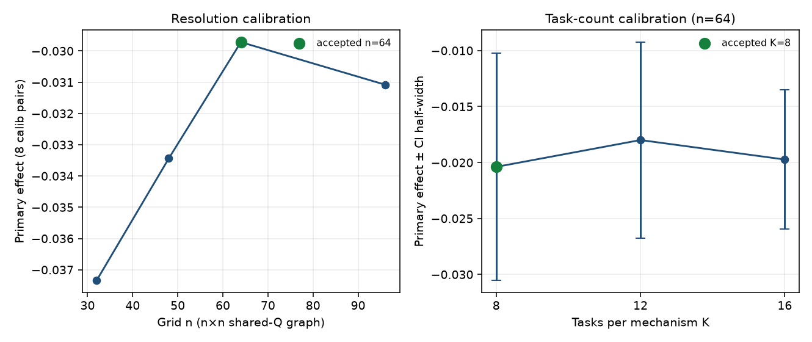
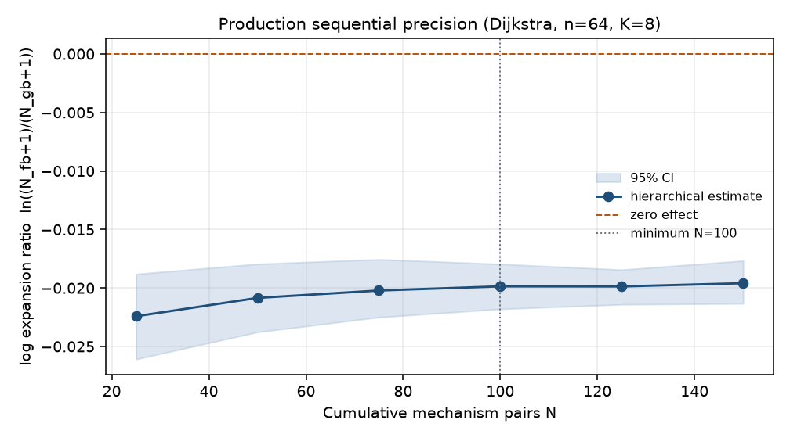
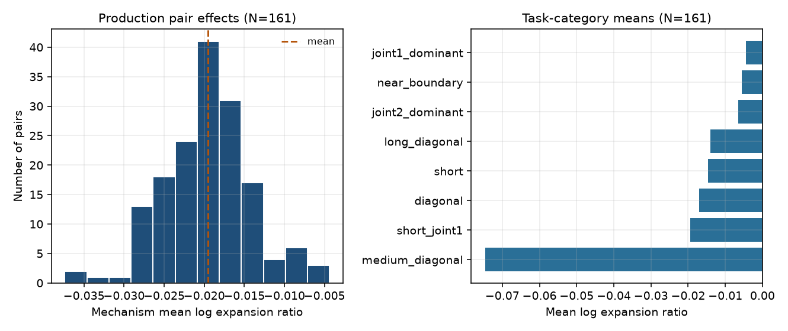
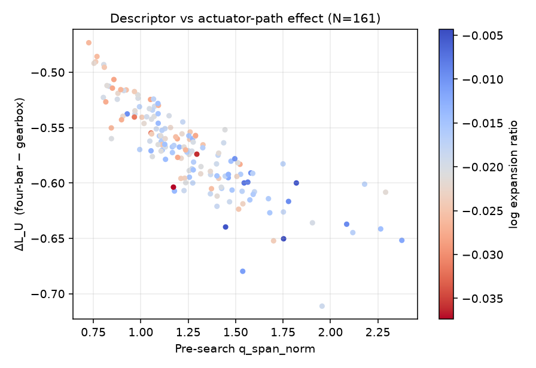
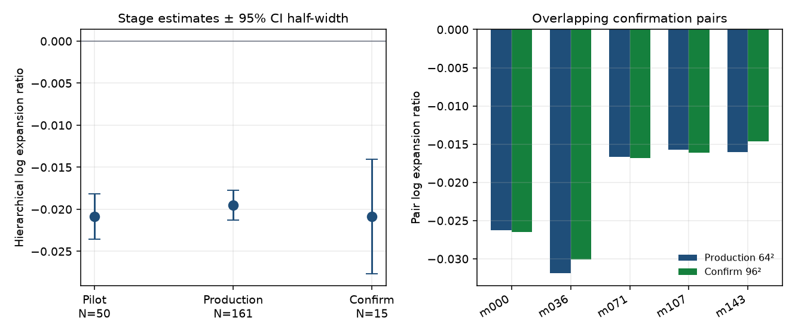
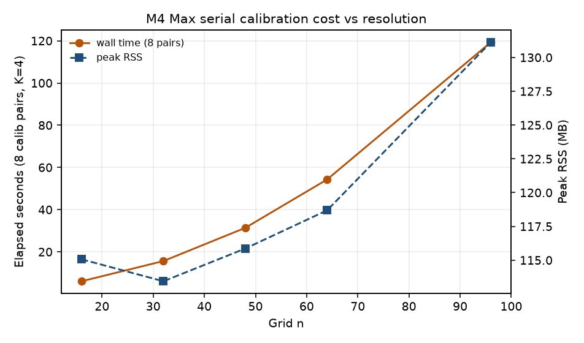

# Sprint V2.10 evidence summary — Dijkstra production Monte Carlo

**Sprint:** [V2.10 Production Monte Carlo Orchestration](../../planning/sprints/v2/SPRINT_V2_10_PRODUCTION_MONTE_CARLO_ORCHESTRATION.md)  
**Issue slug:** `production_monte_carlo_orchestration_v2_9`  
**Solver:** Dijkstra only (`search.algorithm: dijkstra`)  
**Objective:** `actuator_travel` (raw Euclidean actuator distance; no \(Q\) term, \(\alpha\), or planner-side normalization; ADR-017 production family)  
**Frozen sample bank:** `configs/v2/sample_banks/production_v1.json`  
**Sample-bank digest:** `0216920c5703a2d74992171054c9fbdec75927ce4af49909f3b19020a7ccdf20`  
**Calibration decisions:** `results/v2_10_decisions/`  
**Code revision recorded in run packages:** `602c64d55888009ff4cf7e4fa1a18eacf3095ecc` (`git_dirty: true` during closeout)  
**Dashboards:** open [V2_10_PRODUCTION_DIJKSTRA.html](V2_10_PRODUCTION_DIJKSTRA.html) (campaign figures), plus per-run `results/v2_10_production/reports/index.html` and `results/v2_10_confirmation/reports/index.html`.

This report separates **science** from **M4 runtime**. Generated trial rows were not edited.

Figures below are generated from the run packages (not from edited trial rows).

## Run index

| Stage | Run id | Artifact |
| --- | --- | --- |
| Smoke | `v2_10_smoke` | 2/2 shards; canvas |
| Hardware (initial \(n=32\)) | `v2_10_hw_calib` | `environment.json`, `calibration_resources.json` |
| Resolution candidates \(\{16,32,48\}\) | `v2_10_res_cal` | fallback finest \(n=48\); not production |
| Escalated resolution \(\{32,48,64,96\}\) | `v2_10_res_cal_escalated` | **accepted \(n=64\)** vs 96; `resolution_decision.json` |
| Hardware at production \(n=64\) | `v2_10_hw_calib_n64` | peak RSS / pair at accepted \(n\) |
| Task \(K\) | `v2_10_k_cal` | **accepted \(K=8\)**; `task_count_decision.json` |
| Freeze bank | `v2_10_bank` | 500 pairs × 8 tasks exported to `production_v1.json` |
| Variance pilot | `v2_10_pilot` | \(N=50\); hierarchical within/between variance |
| Production | `v2_10_production` | live stop at \(N=161\); `manifest.stop_reason=precision_and_stability` |
| High-res confirmation | `v2_10_confirmation` | preselected 15 ids at \(96\times96\); `confirmation_subset.json` written before search |

Optional \(W\in\{2,4\}\) was **not** accepted. All search stages used `workers: 1` and numerical threads `=1`.

## Science

### Design (frozen before production search)

- Certified monotonic four-bar vs span-matched gearbox on a shared output graph (ADR-012 / ADR-014 / ADR-017).
- Hierarchical sample: mechanism pair is the atomic unit; tasks are nested, not iid.
- Primary effect: mechanism-level mean of \(\log((N_{\mathrm{fb}}+1)/(N_{\mathrm{gb}}+1))\).
- Sequential precision on **mechanism** clusters with `stable_batches_required: 3` after `minimum_mechanisms: 100`.
- Confirmation IDs chosen by stratified `mean_log_gain_var` on the frozen bank **before** confirmation search. IDs:

  `m000000`, `m000036`, `m000071`, `m000107`, `m000143`, `m000178`, `m000214`, `m000250`, `m000285`, `m000321`, `m000356`, `m000392`, `m000428`, `m000463`, `m000499`.

### Calibration decisions

**Resolution (ADR-013).** Escalated candidate set after \(\{16,32,48\}\) failed the 5% relative-effect gate:

| \(n\) | Primary effect | vs next | Rel. change | Accepted pair? |
| ---: | ---: | ---: | ---: | --- |
| 32 | −0.0373 | 48 | 0.117 | no |
| 48 | −0.0334 | 64 | 0.125 | no |
| **64** | **−0.0297** | **96** | **0.044** | **yes (`coarsest_stable`)** |
| 96 | −0.0311 | — | — | confirmation only |

Rejected production alternatives: \(n\in\{16,32,48\}\). **\(n=128\) was not run** after \(64\) vs \(96\) met the gate; it remains an unevaluated finer candidate, not a silent shrink after seeing outcomes.

**Task count.** Same calibration bank at \(n=64\), \(K\in\{8,12,16\}\). Recorded decision: **\(K=8\)** (`smallest_stable_k`) under the calibration YAML threshold `max_relative_estimate_change: 0.20`.

| \(K\) | Effect | CI half-width | Rel. change vs previous |
| ---: | ---: | ---: | ---: |
| **8** | −0.0204 | 0.0101 | — |
| 12 | −0.0180 | 0.0087 | 0.118 |
| 16 | −0.0197 | 0.0062 | 0.097 |

Rejected \(K\in\{12,16\}\). Note: the production sequential threshold is \(0.05\). Under that stricter cutoff the \(K\) sweep would fall back to \(K=16\). On \(N=8\) calibration pairs the CIs overlap, so \(K=8\) was kept as the recorded smallest-stable choice and \(K=16\) remains feasible, not excluded for runtime.

### Variance pilot (\(N=50\), \(n=64\), \(K=8\))

- Trials: \(50\times 8\times 2=800\); failures: 0; feasibility: 100%.
- Estimate: **−0.02085**, 95% CI \([−0.02351,−0.01808]\), half-width \(0.00271\).
- Within-mechanism variance \(7.35\times 10^{-4}\); between-mechanism \(2.32\times 10^{-5}\); between/within ratio **0.032**.
- Task variation dominates mechanism clustering. Task-iid CIs remain forbidden.

### Production (\(N=161\) after live stop)

- Bank cap available: 500. Live schedule: 100, then +25. Stopped with `precision_and_stability` after three stable post-minimum batches (100 / 125 / 150). Final completed count **161** (batch 150–175 was in flight when the stop rule fired after the precision fix; see runtime notes).
- Trials: \(161\times 8\times 2=2576\); failures: 0; feasibility: **2576/2576**.
- Hierarchical estimate: **−0.01953**, 95% CI \([−0.02132,−0.01776]\), \(n=161\).
- CI half-width \(0.00178\) vs target \(0.05\).
- Variance: within \(7.98\times 10^{-4}\), between \(2.92\times 10^{-5}\), ratio **0.037**.

Sequential batches (log expansion ratio):

| \(N\) | Estimate | Half-width | Rel. change | `stable_run` |
| ---: | ---: | ---: | ---: | ---: |
| 25 | −0.02242 | 0.00364 | — | 0 (\(<100\)) |
| 50 | −0.02085 | 0.00291 | 0.070 | 0 |
| 75 | −0.02022 | 0.00247 | 0.030 | 0 |
| 100 | −0.01987 | 0.00192 | 0.018 | 1 |
| 125 | −0.01987 | 0.00149 | 0.0004 | 2 |
| 150 | −0.01960 | 0.00183 | 0.014 | 3 → stop |

Sign is stably negative: four-bar Dijkstra expansions are slightly below the span-matched gearbox on the shared \(Q\) graph under `actuator_travel`. The effect is small in log-expansion units and precisely estimated.

Task-category means (mechanism-nested, production \(N=161\)):

| Category | \(n\) pairs | Mean log expansion |
| --- | ---: | ---: |
| `medium_diagonal` | 161 | −0.0747 |
| `short_joint1` | 161 | −0.0195 |
| `diagonal` | 161 | −0.0171 |
| `short` | 161 | −0.0146 |
| `long_diagonal` | 161 | −0.0140 |
| `joint2_dominant` | 161 | −0.0065 |
| `near_boundary` | 161 | −0.0056 |
| `joint1_dominant` | 161 | −0.0044 |

### Descriptor–effect correlations (production)

Pre-search bank descriptors vs mechanism-level effects (\(N=161\)):

| Descriptor | vs log expansion (Spearman) | vs \(\Delta L_U\) (Spearman) |
| --- | ---: | ---: |
| `q_span_norm` | 0.396 | **−0.879** |
| `mean_log_gain_var` | 0.216 | **−0.601** |
| `conditioning_margin` | 0.349 | −0.533 |
| `gain_asymmetry` | 0.140 | −0.232 |

Output-span and gain variability track actuator-path differences much more strongly than expansion-count differences. This is a descriptive association on the frozen bank, not a causal claim.

### High-resolution confirmation (\(n=96\), 15 stratified pairs)

- Subset file written before search: `results/v2_10_confirmation/confirmation_subset.json` (`selected_before_search: true`, shape `[96,96]`).
- Trials: 240; failures: 0; feasibility: 240/240.
- Confirmation estimate: **−0.02085**, 95% CI \([−0.02767,−0.01400]\).
- Production estimate −0.01953. **Sign agrees.** Magnitude is within ~0.0013.
- Of the 15 confirmation IDs, 5 also finished in the production prefix (\(N=161\) of bank order). On those five: **5/5 sign agreement**; mean \(|\Delta|\) of paired effects \(0.00080\).

Confirmation was drawn from the full 500-pair bank, not from production survivors. Non-overlap of the other 10 IDs is expected and is not post-hoc selection.

## M4 runtime

Hardware was discovered at runtime, not assumed from the sprint’s “M4 Pro” label.

| Field | Observed |
| --- | --- |
| Chip | **Apple M4 Max** (`Mac16,6`) |
| Memory | 36 GB (`total_memory_bytes` \(38654705664\)) |
| OS | macOS 15.7.4 |
| Physical / logical CPUs | 14 / 14 |
| Runner workers | 1 |
| Numerical thread env | `OMP/OPENBLAS/MKL/VECLIB/NUMEXPR=1` |

Resource calibration (serial pair, peak RSS):

| Shape | Pairs | Wall time (stage) | Peak RSS / pair (max) |
| --- | ---: | ---: | ---: |
| \(16^2\) | 8 | 6.1 s | 115 MB |
| \(32^2\) | 8 | 15.5 s | 116 MB |
| \(48^2\) | 8 | 31.5 s | 117 MB |
| \(64^2\) | 8 | 54.3 s | 119 MB |
| \(96^2\) | 8 | 119.3 s | 131 MB |

Configured `execution.worker_peak_rss_bytes: 137494528` (96² max) so production and confirmation share one calibrated ceiling. Preflight uses \(R_{\mathrm{parent}}+W\cdot R_{\mathrm{worker,peak}}+R_{\mathrm{margin}}\) at 65% of 36 GB. Uncalibrated production launch is refused.

Approximate search throughput at production settings (\(64^2\), \(K=8\), \(W=1\)): ~7.3 s / pair. Pilot \(N=50\) ≈ 6 min. Production to stop ≈ 18 min search plus merge. Confirmation \(96^2\) ≈ 15 s / pair, 15 pairs ≈ 3.9 min.

Workers \(>1\) were not enabled. Scientific multi-worker equivalence remains available in tests but was not accepted for this campaign.

## Exclusions and limitations

- **\(n=128\):** unevaluated after \(64\) vs \(96\) stability. Not claimed equivalent.
- **\(K=16\):** feasible; rejected by the recorded \(K=8\) decision under the calibration 0.20 relative-change rule. A 0.05 rule would have selected \(K=16\).
- **Population after stop:** 339 bank pairs remain unused by production search. The bank itself is unchanged and still contains 500 pairs for later A\*.
- **Grid anisotropy:** four-connected refinement is not isotropy (ADR-013 limitation copied into every manifest).
- **Dirty tree:** run packages record `git_dirty: true` relative to `602c64d`. Interpret numerical results with the closeout runner/analysis present in this working tree.
- **No A\***, PRM/RRT/OMPL, 3R, \(Q\)–\(U\) blend, or \(\alpha\) sweep in this campaign.
- Sequential precision originally truncated batch history at the first qualifying \(N\ge 100\), which blocked `stable_batches_required: 3`. That was fixed in `sequential_precision_report` mid-campaign; production was interrupted and resumed. Completed scientific rows were not rewritten.

## Frozen bank for later A\*

`configs/v2/sample_banks/production_v1.json` is the immutable hierarchical sample for later solver campaigns ([project note](../../architecture/notes/PROJECT_NOTE_FUTURE_SEARCH_ALGORITHMS.md)). Production and confirmation configs point at this path via `study.sample_bank`. Do not regenerate in place.

## Software closeout (V2-901–V2-912 gaps closed here)

- Resolution / task-\(K\) CLI stages write decision JSON with rejected alternatives.
- Production / pilot / confirmation refuse missing \(n\), \(K\), and uncalibrated peak RSS.
- Confirmation subset is stratified and frozen before search; shape is the next higher candidate (\(96\)).
- Descriptor–effect Spearman/Pearson tables are on the production canvas.
- One pair-build retry preserves `failures/*.attemptN.json`.
- Generate-only `--stage build_sample_bank` plus `--export-sample-bank`.
- Failed shards are not treated as completed on resume.
