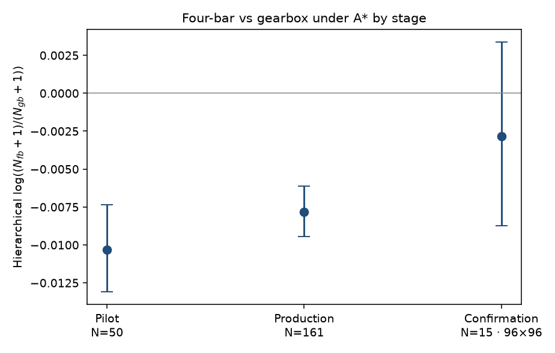
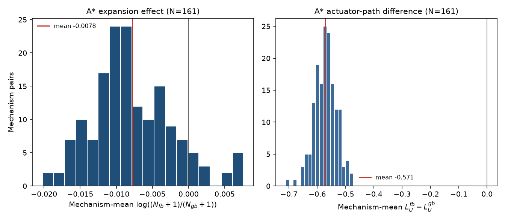
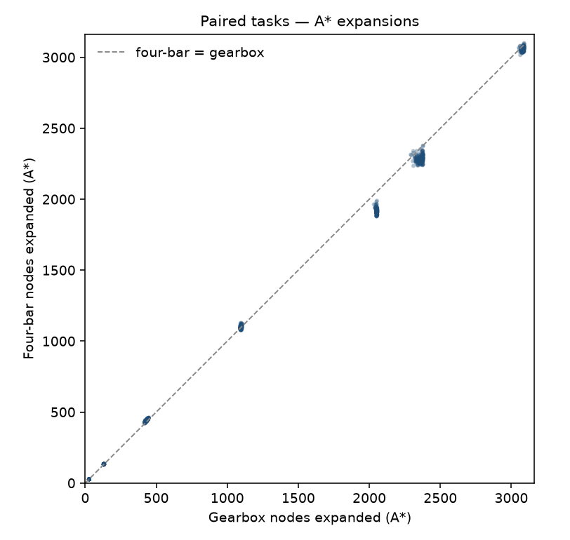
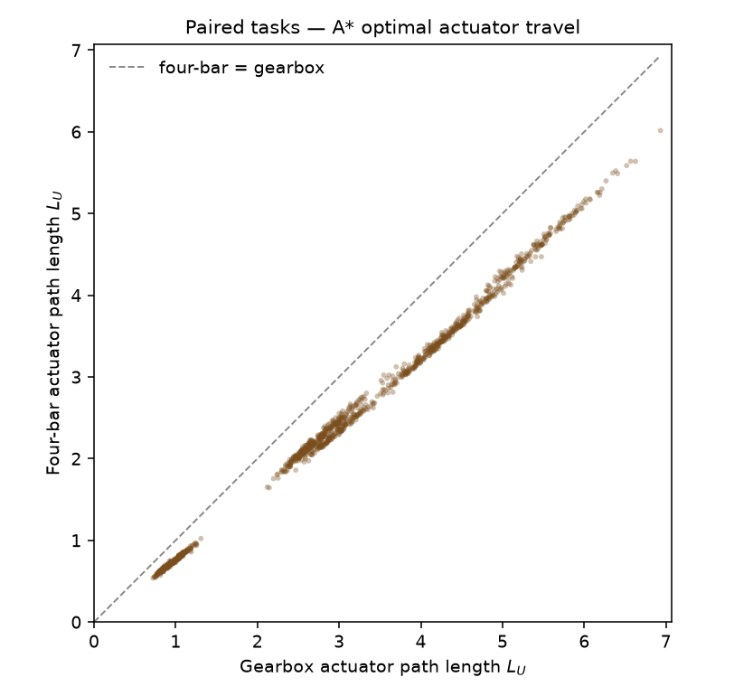
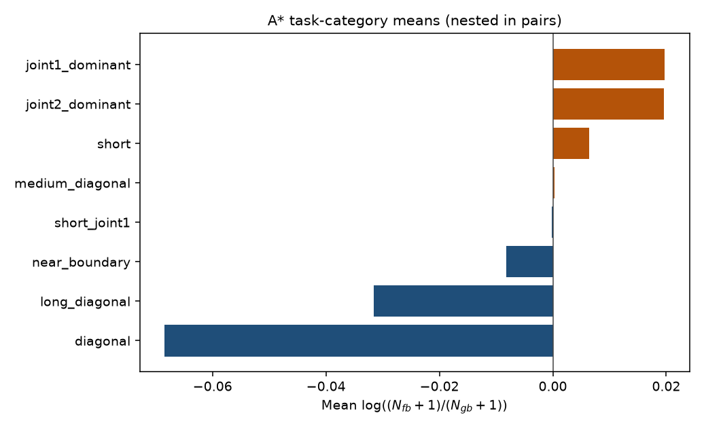
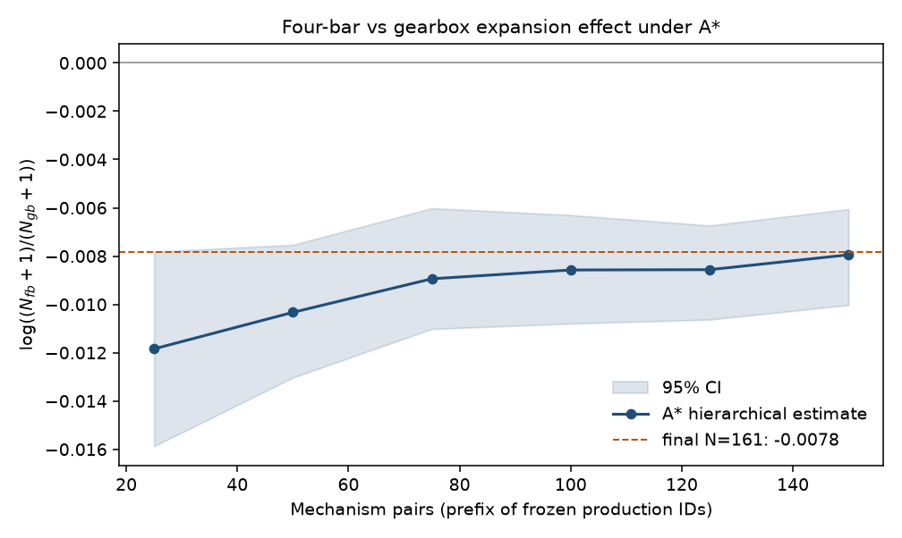
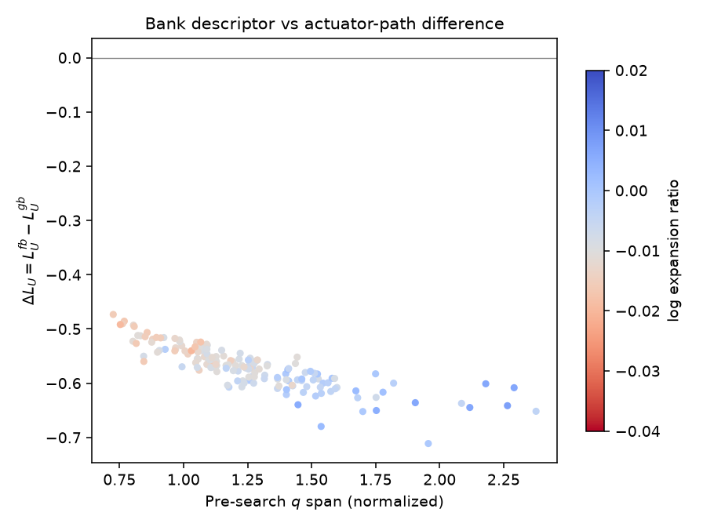
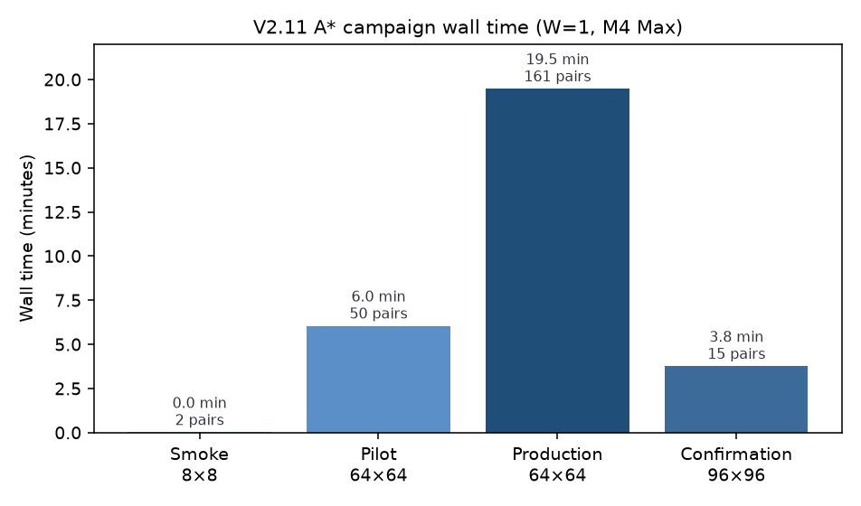

# Sprint V2.11 evidence summary — A* paired campaign

**Sprint:** [V2.11 A* Paired Campaign](../../planning/sprints/v2/SPRINT_V2_11_ASTAR_PAIRED_CAMPAIGN.md)  
**Solver:** A* only (`search.algorithm: astar`, `heuristic: input_euclidean`, ADR-018)  
**Reference:** frozen V2.10 Dijkstra packages (Dijkstra is not rerun inside this campaign)  
**Objective:** `actuator_travel`  
**Frozen sample bank:** `configs/v2/sample_banks/production_v1.json`  
**Sample-bank digest:** `0216920c5703a2d74992171054c9fbdec75927ce4af49909f3b19020a7ccdf20`  
**Code revision recorded in run packages:** `0fb313d1434ee17d7affb71901172ca01a30a43d` (`git_dirty: true` — V2.11 patch applied, not yet committed)  
**Hardware:** Apple M4 Max, 36 GB, `workers: 1`

This report separates the **mechanism expansion effect under A\*** from **heuristic savings relative to Dijkstra**. Generated trial rows were not edited. The frozen bank file was not regenerated.

Figures are generated from the run packages.

## Run index

| Stage | Run id | Artifact |
| --- | --- | --- |
| Smoke | `v2_11_astar_smoke` | 2/2 shards; same smoke-bank digest as `v2_10_smoke`; cost Δ = 0 on 8/8 trials |
| Paired pilot | `v2_11_astar_pilot` | 50/50 IDs replayed from `results/v2_10_pilot`; 800 trials |
| Paired production | `v2_11_astar_production` | **161/161** IDs replayed from `results/v2_10_production`; no sequential stop; 2576 trials |
| High-res confirmation | `v2_11_astar_confirmation` | frozen 15 IDs at \(96\times96\); 240 trials |
| Solver comparison | `reports/solver_comparison.json` | auto-written on reference stages; regenerated via `scripts/compare_v2_solver_campaigns.py` |
| Clustered comparison | `results/v2_11_astar_production/reports/clustered_solver_comparison.json` | mechanism-pair \(\Delta_{A^*-D}\) and family \(S_m\) |

## Frozen basis (unchanged)

- Bank digest matches V2.10 production / pilot / confirmation.
- Production resolution \(64\times64\), \(K=8\), `actuator_travel`.
- A* production scheduled exactly the 161 completed Dijkstra production IDs (`reference_mechanism_count: 161`). Manifest `stop_reason` is `null`; `n_pending: 0` (only the reference set was queued).
- Confirmation reused `results/v2_10_confirmation/confirmation_subset.json` byte-for-byte IDs:

  `m000000`, `m000036`, `m000071`, `m000107`, `m000143`, `m000178`, `m000214`, `m000250`, `m000285`, `m000321`, `m000356`, `m000392`, `m000428`, `m000463`, `m000499`.

## Exact-search gates

| Check | Smoke | Pilot | Production | Confirmation |
| --- | --- | --- | --- | --- |
| Feasibility | 8/8 | 800/800 | 2576/2576 | 240/240 |
| Failures | 0 | 0 | 0 | 0 |
| Max \(\lvert C_{A^*}-C_D\rvert\) | 0 | 0 | 0 | 0 |
| \(\lvert\Delta L_U\rvert\) | — | 0 | 0 | 0 |
| Identical node paths | — | 96.5% | 97.3% | 66.7% |
| Solver / heuristic metadata | `astar` / `input_euclidean` | same | same | same |
| Graph shape | \(8\times8\) | \(64\times64\) | \(64\times64\) | \(96\times96\) |

Optimal costs agree for every paired feasible query. Alternate optimal paths exist (especially at confirmation resolution) but actuator path length \(L_U\) still matches exactly.

Smoke Dijkstra equality used the independently generated smoke banks; digests matched (`4c23c6f8…`) so the 8×8 pairing is valid. Production/pilot/confirmation equality uses the frozen `production_v1` bank.

## Science

Primary mechanism effect (unchanged definition from V2.10):

\[
\log\!\left(\frac{N_{\mathrm{fb}}+1}{N_{\mathrm{gb}}+1}\right)
\]

averaged within a mechanism pair across \(K=8\) tasks, then estimated with hierarchical bootstrap across pairs.

Paired solver shift (V2-1105):

\[
\Delta_{A^*-D}
=
\log\!\left(\frac{N_{\mathrm{fb},A^*}+1}{N_{\mathrm{gb},A^*}+1}\right)
-
\log\!\left(\frac{N_{\mathrm{fb},D}+1}{N_{\mathrm{gb},D}+1}\right).
\]

Heuristic savings on one side / task:

\[
S=1-\frac{N_{\mathrm{expanded},A^*}+1}{N_{\mathrm{expanded},D}+1}.
\]

Inference remains mechanism-clustered. Tasks are nested observations, not iid samples. The machine-written `solver_comparison.json` reports unclustered trial-mean \(S\); clustered family means are in `clustered_solver_comparison.json` and the tables below.

### Pilot (\(N=50\), \(64\times64\))

| Solver | Hierarchical estimate | 95% CI |
| --- | ---: | --- |
| Dijkstra (V2.10) | −0.02085 | \([−0.02351,−0.01808]\) |
| A* (V2.11) | **−0.01033** | \([−0.01308,−0.00735]\) |

- Mean pair \(\Delta_{A^*-D}\): **+0.01052** (all 50 pairs less negative under A* than under Dijkstra).
- Sign under A*: 50/50 negative.
- Clustered mean \(S\): four-bar **0.648**, gearbox **0.646**.
- Unclustered trial-mean \(S\): 0.647.
- Within/between variance ratio under A*: 0.018 (task variation still dominates).

### Production (\(N=161\), full Dijkstra reference set)

| Solver | Hierarchical estimate | 95% CI | Half-width |
| --- | ---: | --- | ---: |
| Dijkstra (V2.10) | −0.01953 | \([−0.02132,−0.01776]\) | 0.00178 |
| A* (V2.11) | **−0.00781** | \([−0.00946,−0.00611]\) | 0.00167 |

- Trials: \(161\times 8\times 2=2576\); failures: 0.
- Mean pair \(\Delta_{A^*-D}\): **+0.01171** (median +0.01095). Only 2/161 pairs have \(\Delta<0\).
- A* sign: **146/161** negative (90.7%). Dijkstra sign on the same IDs: 161/161 negative.
- Clustered mean \(S\): four-bar **0.646**, gearbox **0.646**.
- Unclustered trial-mean \(S\): 0.646 (\(n=2576\)).
- Using pair-side mean expansions before \(S\) (less sensitive to short tasks): four-bar 0.556, gearbox 0.555.
- Variance under A*: within \(9.27\times10^{-4}\), between \(3.10\times10^{-5}\), ratio **0.033**.

The four-bar versus gearbox **expansion-count** contrast remains negative under informed exact search, but it is **smaller** than under Dijkstra. That is expected to be possible: A* changes which nodes each family expands, so \(N_{\mathrm{expanded}}\) is not a solver-invariant mechanism functional. Optimal **cost** and \(L_U\) are solver-invariant here.

Task-category means (production, nested in pairs):

| Category | Dijkstra | A* |
| --- | ---: | ---: |
| `diagonal` | −0.0171 | −0.0684 |
| `long_diagonal` | −0.0140 | −0.0316 |
| `near_boundary` | −0.0056 | −0.0082 |
| `short_joint1` | −0.0195 | −0.0002 |
| `medium_diagonal` | −0.0747 | +0.0003 |
| `short` | −0.0146 | +0.0064 |
| `joint2_dominant` | −0.0065 | +0.0196 |
| `joint1_dominant` | −0.0044 | +0.0197 |

Category order is **not** preserved. Heuristic focus rearranges which task geometries show a four-bar expansion advantage. Do not treat V2.10 category rankings as A* rankings.

### High-resolution confirmation (\(N=15\), \(96\times96\))

| Solver | Hierarchical estimate | 95% CI |
| --- | ---: | --- |
| Dijkstra (V2.10) | −0.02085 | \([−0.02767,−0.01400]\) |
| A* (V2.11) | **−0.00285** | \([−0.00875,+0.00339]\) |

- Trials: 240; failures: 0; shape on every row: `[96, 96]`.
- Mean pair \(\Delta_{A^*-D}\): **+0.01800**.
- A* sign: 8/15 negative. Dijkstra sign: 15/15 negative.
- Clustered mean \(S\): four-bar 0.639, gearbox 0.642.
- A* confirmation CI **includes zero**. Dijkstra confirmation on the same IDs does not.

Confirmation is a small stratified slice, not a second production stop. The sign agreement that held for Dijkstra at \(96\times96\) is weaker for expansion counts under A*. Optimal-cost equality still holds at confirmation resolution.

## Runtime (M4 Max)

| Stage | Pairs | Shape | Wall (`progress.elapsed_s`) | ≈ s / pair |
| --- | ---: | --- | ---: | ---: |
| Smoke | 2 | \(8^2\) | 0.7 s | 0.35 |
| Pilot | 50 | \(64^2\) | 362 s | 7.2 |
| Production | 161 | \(64^2\) | 1169 s | 7.3 |
| Confirmation | 15 | \(96^2\) | 225 s | 15.0 |

Graph construction still dominates; search-time heuristic savings do not shrink wall time much at \(W=1\). Workers \(>1\) were not enabled.

Printable self-contained dashboard: [V2_11_ASTAR_PAIRED_CAMPAIGN.html](V2_11_ASTAR_PAIRED_CAMPAIGN.html) (figures inlined; use the browser print dialog).

## Exclusions and limitations

- **No independent sequential stop** on A* production. The 161-ID set is the V2.10 live-stop population, not a newly powered A* sample-size choice.
- **Expansion ratio is solver-dependent.** Cost optimality is not. Claims about “search effort” must name the solver.
- **Confirmation \(N=15\)** is too small to claim that the A* expansion effect vanishes at \(96\times96\); the CI crossing zero is a limitation, not a null-effect proof.
- **`n_heuristic_calls`** is aliased to `n_generated` in the current `best_first_search` counter (1:1 today).
- **Canvas HTML** generated by the runner still carries Dijkstra chrome; use this report and `solver_comparison.json` for solver identity.
- **Unclustered `mean_heuristic_savings`** in `solver_comparison.json` treats trials as exchangeable. Clustered family \(S_m\) is reported separately above.
- **Dirty tree:** packages record `git_dirty: true` relative to `0fb313d`.
- Out of scope (unchanged): weighted/anytime A*, bidirectional search, PRM/RRT/OMPL, bank regeneration, \(W>1\), 3R, new objectives.

## Exit criteria

1. A* configs are single-solver and require `input_euclidean` — yes.
2. Bank digest and reference IDs match V2.10 — yes.
3. Optimal costs agree on every paired feasible query — yes (Δ = 0).
4. Production completed all 161 reference IDs without an independent stop — yes.
5. Confirmation reused the frozen 15-ID subset at \(96\times96\) — yes.
6. This report separates A* mechanism effect from heuristic savings — yes.
7. Frozen bank unchanged — `git status` clean on `configs/v2/sample_banks/production_v1.json`; run digests remain `0216920c…`.
