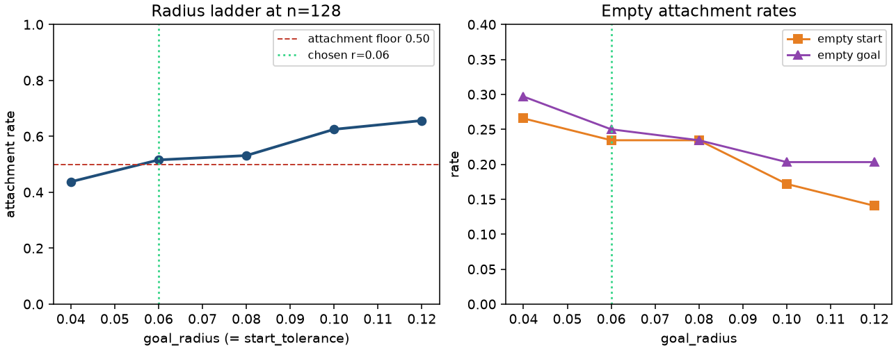
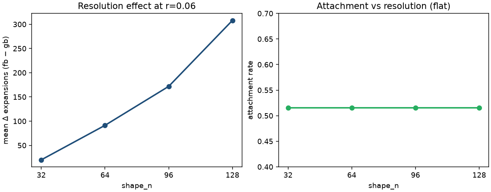
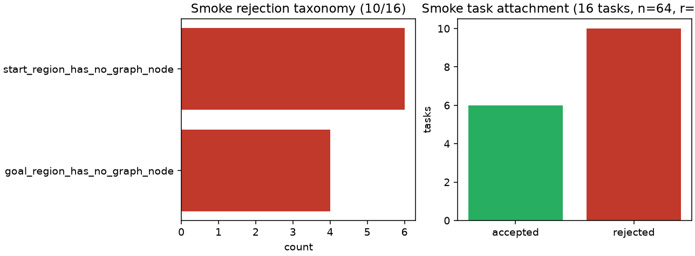
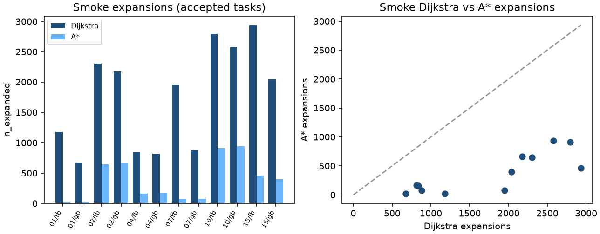

# Sprint V2.12 evidence summary — Cartesian goal-region smoke and calibration

**Sprint:** [V2.12 Cartesian Goal-Region Planning](../../planning/sprints/v2/SPRINT_V2_12_CARTESIAN_GOAL_REGION_PLANNING.md)  
**Experiment:** **Experiment B** (known physical start → Cartesian position goal region)  
**Protocol:** [`EXPERIMENT_B_CARTESIAN_GOAL_REGION.md`](../protocols/EXPERIMENT_B_CARTESIAN_GOAL_REGION.md)  
**Contracts:** [ADR-019](../../architecture/adr/ADR-019-v2-cartesian-task-domain.md) (domain), [ADR-020](../../architecture/adr/ADR-020-v2-goal-set-search.md) (goal-set search)  
**Objective:** `actuator_travel`  
**Domain:** `planar2r_left_workcell_v1` (area-uniform annular sector)  
**Pair:** one certified monotonic crank-rocker vs span-matched gearbox on a shared uniform-\(\mathcal Q\) graph  
**Code revisions in packages:** smoke `9917c26…` (`git_dirty: true`); calibration `687eefd…`  
**Printouts:** per-run `results/v2_12_cartesian_smoke/index.html`, `results/v2_12_cartesian_calibration/index.html`  
**Dashboard:** [V2_12_CARTESIAN_GOAL_REGION.html](V2_12_CARTESIAN_GOAL_REGION.html)

This report is the **smoke + V2B-005 calibration** evidence package for Experiment B. It is **not** a population Monte Carlo and does **not** authorize crossed-mechanism inference. Experiment A (V2.10/V2.11) remains a separate centered \(\mathcal Q\)-probe study; do not combine estimands.

Generated trial / candidate rows were not edited. The ADR-019 domain geometry was not silently retuned.

Figures below are generated from the run packages.

## Run index

| Stage | Run id | Artifact |
| --- | --- | --- |
| Smoke (oracle pair) | `v2_12_cartesian_smoke` | 16 tasks; 6 accepted / 10 rejected; 24 trial rows; Dijkstra+A* cost Δ = 0; `index.html` |
| Calibration (V2B-005) | `v2_12_cartesian_calibration` | 64-task bank; 20 candidates (\(5\) radii \(\times\) \(4\) grids); three decision JSON files; `index.html` |
| Smoke canvas regen | `scripts/generate_v2_cartesian_canvas.py` | regenerable printout beside each package |
| Calibration config | `configs/v2/cartesian_goal_region_calibration.yaml` | `calibration_dijkstra_v1`, Dijkstra only |

## Frozen basis (smoke / calibration)

- Domain id `planar2r_left_workcell_v1`: \(r\in[0.50,1.50]\), \(\varphi\in[2.15,3.55]\), \(L_1=L_2=1\).
- Smoke attachment: `start_tolerance = goal_radius = 0.06`, `min_start_goal_separation = 0.30`, policy `nearest_valid_graph_node_within_tolerance_v1`.
- Smoke graph: \(64\times 64\) shared output lattice; algorithms `[dijkstra, astar]` under `smoke_oracle_pair_v1`.
- Calibration bank: \(K=64\) tasks, seed `20260805`, generated once per run with separation lifted for the largest candidate radius.
- Calibration candidates: radii \(\{0.04,0.06,0.08,0.10,0.12\}\) with `start_tolerance = goal_radius`; grids \(\{32,64,96,128\}\); Dijkstra-only effect sensitivity.
- Attachment floor for radius selection: \(0.50\). Resolution gate: coarsest-stable on mean paired \(\Delta\) expansions with 5% relative change and attachment stability \(\pm 0.05\).

## Exact-search / package gates

| Check | Smoke | Calibration |
| --- | --- | --- |
| Stage | `smoke` | `calibration` |
| Solver policy | `smoke_oracle_pair_v1` | `calibration_dijkstra_v1` |
| Feasible accepted searches | 24/24 trial rows found | 33 paired Dijkstra outcomes at chosen \((r,n)\) among attached tasks |
| Search failures on accepted tasks | 0 | 0 (attachment rejects remain outcomes) |
| Max \(\lvert C_{A^*}-C_D\rvert\) | **0** (12 mechanism×task pairs) | n/a (Dijkstra only) |
| Same selected goal node | 12/12 | n/a |
| Decision JSON written | — | radius + resolution + start-attachment |
| Production refuse-without-decision | exercised in tests | tooling present; population stage held |

## Calibration decisions (frozen in package)

| Decision | Value | Reason |
| --- | --- | --- |
| `goal_radius` / `start_tolerance` | **0.06** | `smallest_radius_meeting_attachment_floor` (attachment \(0.515625\) at \(n=128\)) |
| `min_start_goal_separation` | **0.30** | \(\max(0.30, 2r)\) |
| `production_shape_n` | **128** | `fallback_finest` — no consecutive pair met the 5% effect-stability gate |
| Start attachment | `retain_nearest_node_v1` | nearest-node policy retained; exact-start overlay deferred |

Promote a reviewed copy of the decision directory (for example `results/v2_12_cartesian_decisions/`) before any production `--apply-decisions` stage. Do not commit `results/`.

### Radius ladder (\(n=128\))

| \(r\) | Attachment | Empty start | Empty goal | Mean \(\Delta N\) (fb−gb) |
| ---: | ---: | ---: | ---: | ---: |
| 0.04 | 0.438 | 0.266 | 0.297 | 134.5 |
| **0.06** | **0.516** | 0.234 | 0.250 | 308.0 |
| 0.08 | 0.531 | 0.234 | 0.234 | 280.5 |
| 0.10 | 0.625 | 0.172 | 0.203 | 289.6 |
| 0.12 | 0.656 | 0.141 | 0.203 | 315.2 |

### Resolution ladder (\(r=0.06\))

| \(n\) | Attachment | Mean \(\Delta N\) | Mean \(\Delta C\) | Paired searches |
| ---: | ---: | ---: | ---: | ---: |
| 32 | 0.516 | 20.12 | −0.0346 | 33 |
| 64 | 0.516 | 91.36 | −0.0322 | 33 |
| 96 | 0.516 | 171.85 | −0.0441 | 33 |
| **128** | **0.516** | **308.00** | −0.0452 | 33 |

Relative effect changes between consecutive grids were \(0.78\), \(0.47\), and \(0.44\) — all above the \(0.05\) gate — so coarsest-stable correctly fell back to the finest candidate.

Attachment is **resolution-flat** at the chosen radius; the paired expansion contrast is **not**. That is the scientific reason \(n=128\) was recorded rather than the smoke grid \(n=64\).

## Science

### What this experiment is

Experiment B asks how a nonlinear transmission changes reachability, selected goal posture, path cost, and search effort when the robot starts from a known physical state and must reach a Cartesian disk \(\lVert f(q)-x_g\rVert_2\le\epsilon_X\). Goal nodes are a set; the start is one frozen graph node.

Primary reporting split (ADR-019):

\[
P(\text{task attached/reachable})
\qquad\text{and}\qquad
\mathbb E[\text{search metric}\mid\text{task attached/reachable}].
\]

Crossed task \(\times\) mechanism inference is **not** implemented yet ([project note](../../architecture/notes/PROJECT_NOTE_EXPERIMENT_B_CROSSED_STATISTICS.md)).

### Smoke coverage (\(16\) tasks, \(n=64\), \(r=0.06\))

| Quantity | Value |
| --- | ---: |
| Accepted / rejected | **6 / 10** |
| Attachment rate | 0.375 |
| Empty start | 6 |
| Empty goal | 4 |
| Search failures on accepted | 0 |
| Dijkstra/A* cost disagreements | **0** |
| Mean expansions (Dijkstra / A*) | 1764 / 378 |
| Mean selected-goal residual | 0.0537 |
| Start IK families on accepted | all `elbow_up` |

Descriptive paired means on the six accepted smoke tasks (not a population estimand):

| Solver | Mean \(\Delta N\) (fb−gb) | Mean \(\Delta C\) (fb−gb) |
| --- | ---: | ---: |
| Dijkstra | +473.5 | +0.180 |
| A* | +3.17 | +0.180 |

Optimal costs agree across solvers; expansion counts do not. A* reduces expansions on both mechanisms and nearly collapses the smoke \(\Delta N\) contrast on this tiny accepted set. Do not promote that as a mechanism claim.

### Calibration signal (conditional on attachment)

At the frozen radius, **33** of **64** tasks attach on every tested grid. Conditional on those attached tasks, mean paired \(\Delta N\) grows roughly linearly with \(n\) while attachment stays fixed. Mean paired \(\Delta C\) stays small and negative (\(\approx -0.03\) to \(-0.05\)) across the resolution ladder — a different sign than the six-task smoke descriptive \(\Delta C\). Treat both as provisional: different banks, no crossed CI, no production stop.

Allowed reading:

> Under the frozen left-workcell Cartesian domain and nearest-node attachment, radius \(0.06\) is the smallest candidate meeting the 50% attachment floor at \(n=128\), while expansion-effect stability across grids fails the 5% gate through \(n=128\).

Not allowed:

> Four-bars reduce planning complexity in general.

Not allowed:

> The Experiment A `medium_diagonal` corridor proves a Cartesian advantage.

## Runtime

| Stage | Wall | Notes |
| --- | ---: | --- |
| Smoke | ~minutes (interactive) | 16 tasks × 2 mechs × 2 solvers at \(64^2\) |
| Calibration | **519 s** (~8.7 min) | 20 candidates; Dijkstra on attached tasks; Apple M4 Max, \(W=1\) |

Graph construction dominates finer grids. Workers \(>1\) were not used.

## Exclusions and limitations

- **No population campaign.** One mechanism pair only; no frozen multi-pair Cartesian bank; no shards; no sequential stop.
- **Crossed statistics not accepted.** Pair-nested V2.10/V2.11 bootstrap must not be copied onto Experiment B task rows.
- **Smoke attachment rate 0.375** at \(n=64\), \(r=0.06\) is a correctness signal, not a production coverage claim. Calibration chose the same radius because the floor is evaluated at \(n=128\).
- **`fallback_finest` \(n=128\)** means effect stability is unresolved within the tested candidate set; \(n>128\) was not evaluated.
- **Nearest-node start attachment** is retained, not balanced IK. All six smoke accepted starts were `elbow_up`.
- **Exact-start overlay** remains deferred.
- **Dirty trees / evolving tip:** smoke and calibration packages record the revisions above; later canvas commit `a51079d` regenerates printouts without mutating rows.
- Out of scope: Experiment A bank reuse, 3R / V2.7, PRM/RRT, production Dijkstra/A* split campaigns.

## Exit criteria (smoke + calibration tooling)

1. Goal-set Dijkstra/A* smoke package with immutable evidence — **yes**.
2. Dijkstra/A* optimal-cost agreement on every accepted smoke query — **yes** (Δ = 0).
3. V2B-005 decision JSON for radius, resolution, and start attachment — **yes** (in `results/v2_12_cartesian_calibration/`).
4. Production stage refuses missing decisions — **yes** (unit-tested).
5. Regenerable HTML printouts for both packages — **yes**.
6. Crossed-statistics / population orchestration — **not yet** (held).
7. Sprint V2.12 complete (full exit list in the sprint doc) — **not yet**; this report closes the smoke + calibration evidence slice only.

## Related local printouts

- [`results/v2_12_cartesian_smoke/index.html`](../../../../results/v2_12_cartesian_smoke/index.html)
- [`results/v2_12_cartesian_calibration/index.html`](../../../../results/v2_12_cartesian_calibration/index.html)
- Printable campaign dashboard: [V2_12_CARTESIAN_GOAL_REGION.html](V2_12_CARTESIAN_GOAL_REGION.html)
